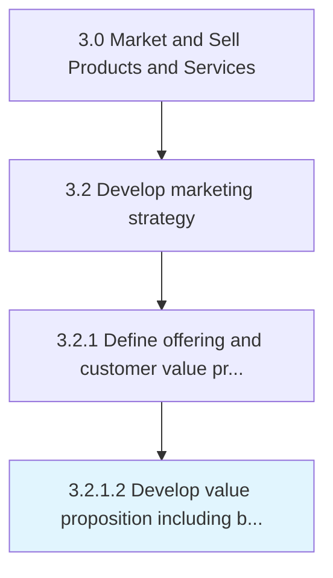

# Develop value proposition including brand positioning for target segments

> Boosting the attractiveness of products/services to the targeted customers, and creating a unique brand projection around these features.

## Overview

Activity 3.2.1.2 is an activity within the Market and Sell Products and Services framework. 

Boosting the attractiveness of products/services to the targeted customers, and creating a unique brand projection around these features. Identify and enhance those product/service features that reinforce the attractiveness of these offerings, for these segment of customers. Underscore the perceived value delivered to the customers by clearly specifying the relevance and desirability of these products/services. Once it has been clarified how the organization's offerings meet the customer's expectations or deliver specific benefits, position the brands around these benefits.

## Process Hierarchy



## Key Statistics

| Metric | Value |
|--------|-------|
| APQC Code | 11170 |
| Hierarchy ID | 3.2.1.2 |
| Level | Activity |
| Parent | [3.2.1](../) |
| Sub-Processes | 0 |


## GraphDL Semantic Structure

```graphdl
develop.ValuePropositionIncludingBrandPositioning.for.TargetSegments
```

| Component | Value | Description |
|-----------|-------|-------------|
| Verb | `develop` | Primary action |
| Object | `value proposition including brand positioning` | Direct object |
| Preposition | `for` | Relationship |
| PrepObject | `target segments` | Indirect object |


## Related Concepts

- ValuePropositionIncludingBrandPositioning
- TargetSegments


---

*Source: APQC PCF 11170 (3.2.1.2) - APQC*
