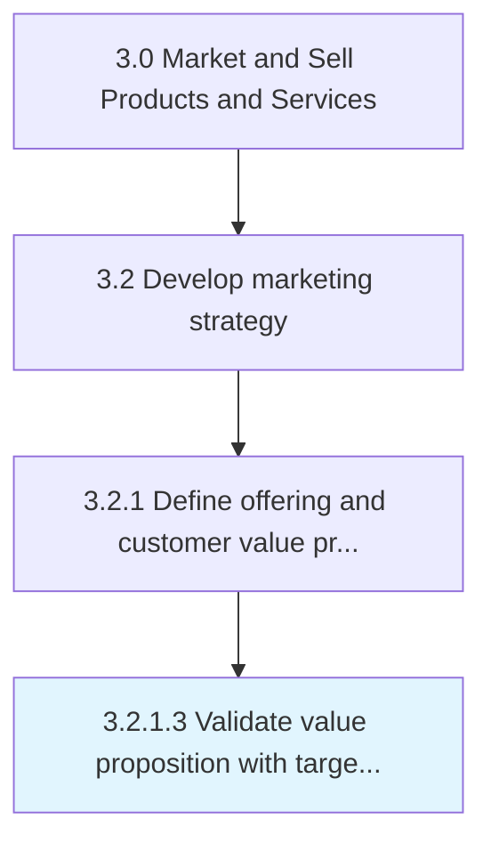

# Validate value proposition with target segments

> Validating the desirability of the perceived value delivered by the organization's offerings, to the targeted customer segment.

## Overview

Activity 3.2.1.3 is an activity within the Market and Sell Products and Services framework. 

Validating the desirability of the perceived value delivered by the organization's offerings, to the targeted customer segment. Substantiate the value of the benefits accrued to the customers through the organization's offerings. Justify the value proposition in light of the targeted segments by gathering feedback (using teaser demonstrations, surveys, interviews, primary research studies, and customer case studies). Corroborate the benefits of the organization's offerings.

## Process Hierarchy



## Key Statistics

| Metric | Value |
|--------|-------|
| APQC Code | 11171 |
| Hierarchy ID | 3.2.1.3 |
| Level | Activity |
| Parent | [3.2.1](../) |
| Sub-Processes | 0 |


## GraphDL Semantic Structure

```
validate.ValueProposition.with.TargetSegments
```

| Component | Value | Description |
|-----------|-------|-------------|
| Verb | `validate` | Primary action |
| Object | `value proposition` | Direct object |
| Preposition | `with` | Relationship |
| PrepObject | `target segments` | Indirect object |


## Related Concepts

- ValueProposition
- TargetSegments


---

*Source: APQC PCF 11171 (3.2.1.3) - APQC*
