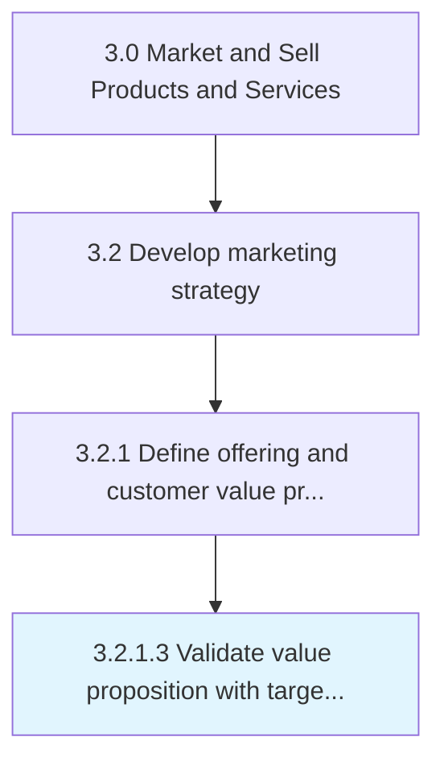
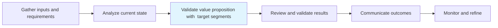

# Validate value proposition with target segments

> Validating the desirability of the perceived value delivered by the organization's offerings, to the targeted customer segment.

## Overview

Activity 3.2.1.3 is an activity within the Market and Sell Products and Services framework.

Validating the desirability of the perceived value delivered by the organization's offerings, to the targeted customer segment. Substantiate the value of the benefits accrued to the customers through the organization's offerings. Justify the value proposition in light of the targeted segments by gathering feedback (using teaser demonstrations, surveys, interviews, primary research studies, and customer case studies). Corroborate the benefits of the organization's offerings.

This process is critical to effective sales and marketing execution. It ensures that activities are systematically planned, executed, and measured against organizational objectives. When performed effectively, this process drives revenue growth, enhances customer engagement, and strengthens competitive positioning in target markets.

## Process Hierarchy



## Key Statistics

| Metric | Value |
|--------|-------|
| APQC Code | 11171 |
| Hierarchy ID | 3.2.1.3 |
| Level | Activity |
| Parent | [3.2.1](../) |
| Sub-Processes | 0 |

## Process Flow



## GraphDL Semantic Structure

```graphdl
validate.ValueProposition.with.TargetSegments
```

| Component | Value | Description |
|-----------|-------|-------------|
| Verb | `validate` | Primary action |
| Object | `value proposition` | Direct object |
| Preposition | `with` | Relationship |
| PrepObject | `target segments` | Indirect object |


## RACI Matrix

| Role | Responsible | Accountable | Consulted | Informed |
|------|:-----------:|:-----------:|:---------:|:--------:|
| Marketing Manager | R |  |  |  |
| CMO / VP Marketing |  | A |  |  |
| Sales Manager |  |  | C |  |
| Product Manager |  |  | C |  |
| Finance Manager |  |  |  | I |

## Related Occupations

- [Marketing Managers](/occupations/Management/MarketingManagers)
- [Advertising And Promotions Managers](/occupations/Management/AdvertisingAndPromotionsManagers)
- [Market Research Analysts](/occupations/Business-and-Financial-Operations/MarketResearchAnalysts)
- [Public Relations Specialists](/occupations/Media-and-Communication/PublicRelationsSpecialists)
- [Sales Managers](/occupations/Management/SalesManagers)

## Related Departments

- [Marketing](/departments/Marketing)
- Product Management
- [Sales](/departments/Sales)

## Industry Variations

### Consumer Products

In consumer products, validate value proposition with target segments centers on brand positioning across multiple product lines, seasonal marketing calendars, and trade marketing strategies.

### Technology

In technology, validate value proposition with target segments emphasizes digital-first strategies, developer community engagement, and product-led growth approaches.

### Life Sciences

In life sciences, validate value proposition with target segments must comply with FDA advertising regulations, focus on HCP engagement, and navigate complex approval processes for promotional materials.

## KPIs & Metrics

| Metric | Description | Target |
|--------|-------------|--------|
| Brand Awareness | Percentage of target market aware of brand and value proposition | >60% |
| Channel ROI | Return on investment across marketing channels | >3:1 |
| Customer Acquisition Cost (CAC) | Average cost to acquire a new customer | Below industry benchmark |
| Marketing Qualified Leads (MQLs) | Number of qualified leads generated by marketing | Quarter-over-quarter growth |

## Related Concepts

- ValueProposition
- TargetSegments

---

*Source: APQC PCF 11171 (3.2.1.3) - APQC*
