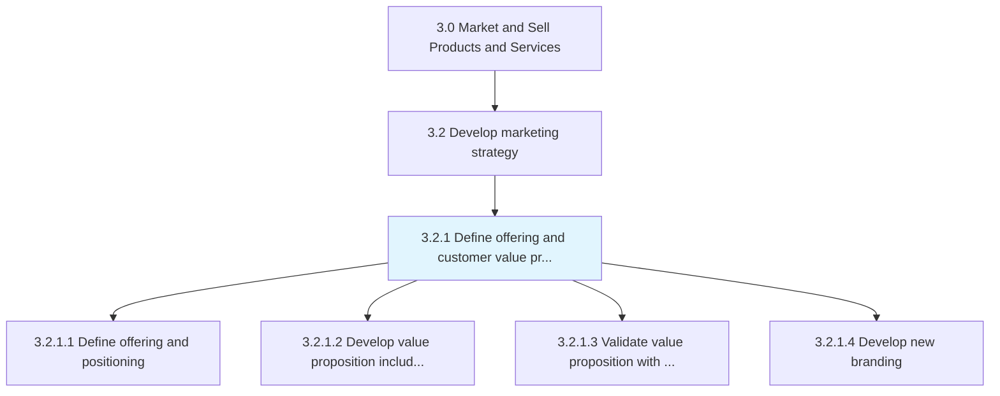
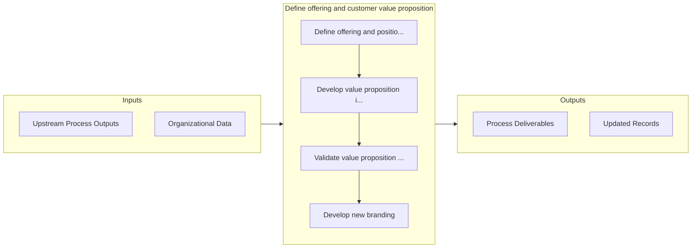

# Define offering and customer value proposition

> Refining the attributes of organizational offerings to define their value proposition for the customer.

## Overview

Process 3.2.1 is a core process that defines the specific procedures for define offering and customer value proposition. 

Refining the attributes of organizational offerings to define their value proposition for the customer. Clearly define the suite of offerings in terms of the value delivered, from the perspective of what the customer desires. Validate the benefits delivered to the customers against target market segments, using techniques such as minimum viable product. Position brands for the respective products/services, in line with their unique value proposition and aligned with customers needs.

## Process Hierarchy



## Key Statistics

| Metric | Value |
|--------|-------|
| APQC Code | 11168 |
| Hierarchy ID | 3.2.1 |
| Level | Process |
| Parent | [3.2](../) |
| Sub-Processes | 4 |


## GraphDL Semantic Structure

```
define.OfferingAndCustomerValueProposition
```

| Component | Value | Description |
|-----------|-------|-------------|
| Verb | `define` | Primary action |
| Object | `offering and customer value proposition` | Direct object |


## Process Flow



## Sub-Processes

| Process | Hierarchy ID | Description |
|---------|-------------|-------------|
| [Define offering and positioning](./DefineOfferingAndPositioning) | 3.2.1.1 | Defining problem(s) that the organization's products/services solve for the customers, thereby deter |
| [Develop value proposition including brand positioning for target segments](./DevelopValuePropositionIncludingBrandPositioningForTargetSegments) | 3.2.1.2 | Boosting the attractiveness of products/services to the targeted customers, and creating a unique br |
| [Validate value proposition with target segments](./ValidateValuePropositionWithTargetSegments) | 3.2.1.3 | Validating the desirability of the perceived value delivered by the organization's offerings, to the |
| [Develop new branding](./DevelopNewBranding) | 3.2.1.4 | Creating branding collaterals and campaigns that carve a significant and differentiated presence for |


## Related Concepts

- [OfferingValueProposition](/concepts/OfferingValueProposition)
- [CustomerValueProposition](/concepts/CustomerValueProposition)


---

*Source: APQC PCF 11168 (3.2.1) - APQC*
