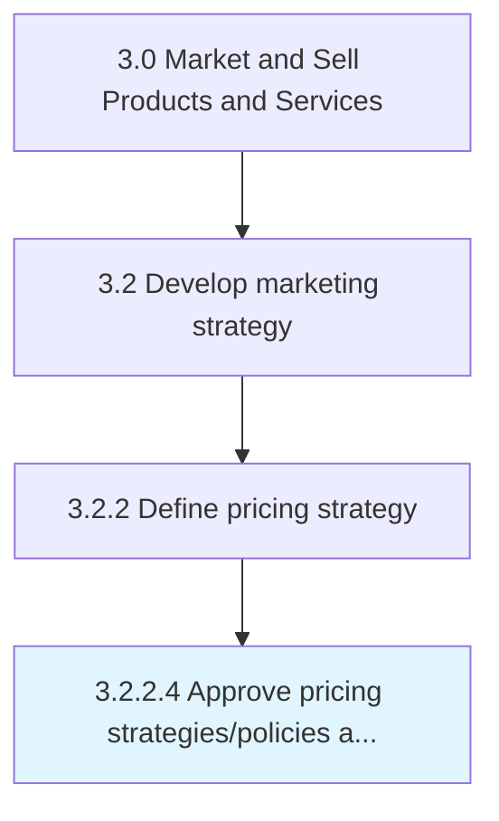

# Approve pricing strategies/policies and targets

> Confirming the strategy and specifications developed for pricing the organization's products/services.

## Overview

Activity 3.2.2.4 is an activity within the Market and Sell Products and Services framework. 

Confirming the strategy and specifications developed for pricing the organization's products/services. Approve pricing guidelines by vetting the soundness of the methodology and the guidelines' alignment with the value proposition.

## Process Hierarchy



## Key Statistics

| Metric | Value |
|--------|-------|
| APQC Code | 10125 |
| Hierarchy ID | 3.2.2.4 |
| Level | Activity |
| Parent | [3.2.2](../) |
| Sub-Processes | 0 |


## GraphDL Semantic Structure

```
approve.PricingStrategiespoliciesAndTargets
```

| Component | Value | Description |
|-----------|-------|-------------|
| Verb | `approve` | Primary action |
| Object | `pricing strategies/policies and targets` | Direct object |


## Related Concepts

- PricingStrategies
- PricingPolicies
- Targets


---

*Source: APQC PCF 10125 (3.2.2.4) - APQC*
