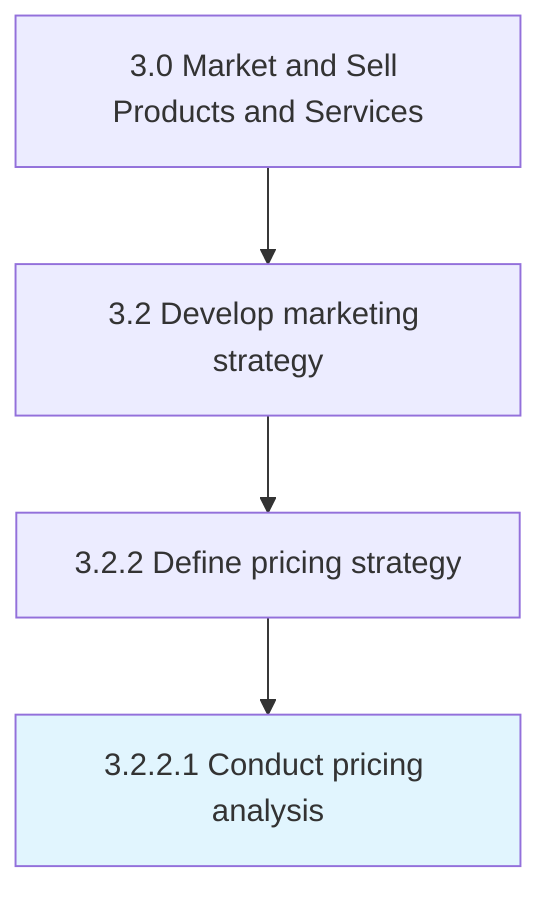

# Conduct pricing analysis

> Analyzing marketing objectives, consumer demand, product attributes, competitors' pricing, and economic trends to determine optimum prices for the set of products and services that the company offers or intends to offer by delivering maximum ROI.

## Overview

Activity 3.2.2.1 is an activity within the Market and Sell Products and Services framework. 

Analyzing marketing objectives, consumer demand, product attributes, competitors' pricing, and economic trends to determine optimum prices for the set of products and services that the company offers or intends to offer by delivering maximum ROI.

## Process Hierarchy



## Key Statistics

| Metric | Value |
|--------|-------|
| APQC Code | 13169 |
| Hierarchy ID | 3.2.2.1 |
| Level | Activity |
| Parent | [3.2.2](../) |
| Sub-Processes | 0 |


## GraphDL Semantic Structure

```
conduct.PricingAnalysis
```

| Component | Value | Description |
|-----------|-------|-------------|
| Verb | `conduct` | Primary action |
| Object | `pricing analysis` | Direct object |


## Related Concepts

- PricingAnalysis


---

*Source: APQC PCF 13169 (3.2.2.1) - APQC*
