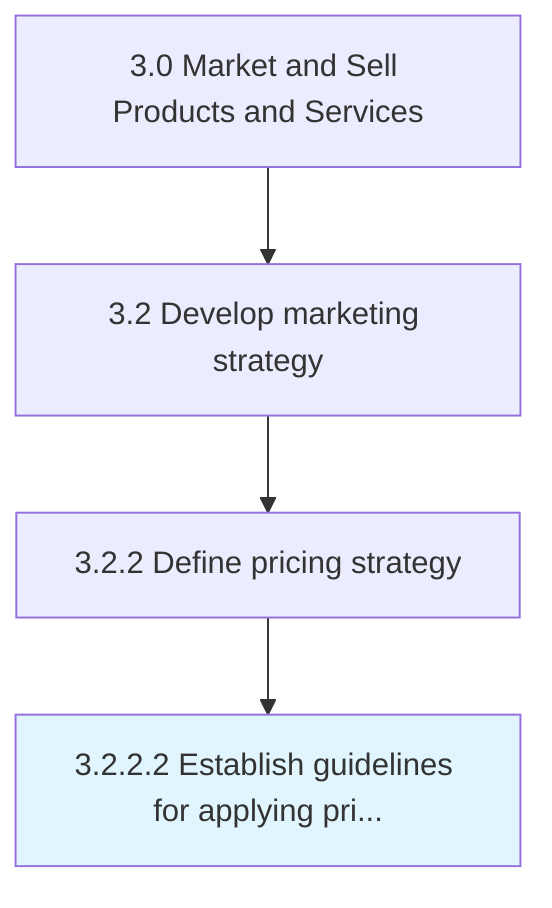
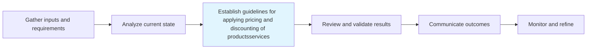

# Establish guidelines for applying pricing and discounting of products/services

> Creating a framework that allows for a uniform methodology while determining the price of individual offerings.

## Overview

Activity 3.2.2.2 is an activity within the Market and Sell Products and Services framework.

Creating a framework that allows for a uniform methodology while determining the price of individual offerings. Devise a blueprint for establishing the pricing of specific products/services. Create guidelines that factor in the cost of production/servicing, price sensitivity, product lifecycle, and the price of competing/substitute products.

This process is critical to effective sales and marketing execution. It ensures that activities are systematically planned, executed, and measured against organizational objectives. When performed effectively, this process drives revenue growth, enhances customer engagement, and strengthens competitive positioning in target markets.

## Process Hierarchy



## Key Statistics

| Metric | Value |
|--------|-------|
| APQC Code | 10124 |
| Hierarchy ID | 3.2.2.2 |
| Level | Activity |
| Parent | [3.2.2](../) |
| Sub-Processes | 0 |

## Process Flow



## GraphDL Semantic Structure

```graphdl
establish.Guidelines.for.ApplyingPricingAndDiscountingOfProductsservices
```

| Component | Value | Description |
|-----------|-------|-------------|
| Verb | `establish` | Primary action |
| Object | `guidelines` | Direct object |
| Preposition | `for` | Relationship |
| PrepObject | `applying pricing and discounting of products/services` | Indirect object |


## RACI Matrix

| Role | Responsible | Accountable | Consulted | Informed |
|------|:-----------:|:-----------:|:---------:|:--------:|
| Marketing Manager | R |  |  |  |
| CMO / VP Marketing |  | A |  |  |
| Sales Manager |  |  | C |  |
| Product Manager |  |  | C |  |
| Finance Manager |  |  |  | I |

## Related Occupations

- [Marketing Managers](/occupations/Management/MarketingManagers)
- [Advertising And Promotions Managers](/occupations/Management/AdvertisingAndPromotionsManagers)
- [Market Research Analysts](/occupations/Business-and-Financial-Operations/MarketResearchAnalysts)
- [Public Relations Specialists](/occupations/Media-and-Communication/PublicRelationsSpecialists)
- [Sales Managers](/occupations/Management/SalesManagers)

## Related Departments

- [Marketing](/departments/Marketing)
- Product Management
- [Sales](/departments/Sales)

## Industry Variations

### Consumer Products

In consumer products, establish guidelines for applying pricing and discounting of products/services centers on brand positioning across multiple product lines, seasonal marketing calendars, and trade marketing strategies.

### Technology

In technology, establish guidelines for applying pricing and discounting of products/services emphasizes digital-first strategies, developer community engagement, and product-led growth approaches.

### Life Sciences

In life sciences, establish guidelines for applying pricing and discounting of products/services must comply with FDA advertising regulations, focus on HCP engagement, and navigate complex approval processes for promotional materials.

## KPIs & Metrics

| Metric | Description | Target |
|--------|-------------|--------|
| Brand Awareness | Percentage of target market aware of brand and value proposition | >60% |
| Channel ROI | Return on investment across marketing channels | >3:1 |
| Customer Acquisition Cost (CAC) | Average cost to acquire a new customer | Below industry benchmark |
| Marketing Qualified Leads (MQLs) | Number of qualified leads generated by marketing | Quarter-over-quarter growth |

## Related Concepts

- Guidelines
- ApplyingPricingOfProducts/Services
- Guidelines
- DiscountingOfProducts/Services

---

*Source: APQC PCF 10124 (3.2.2.2) - APQC*
