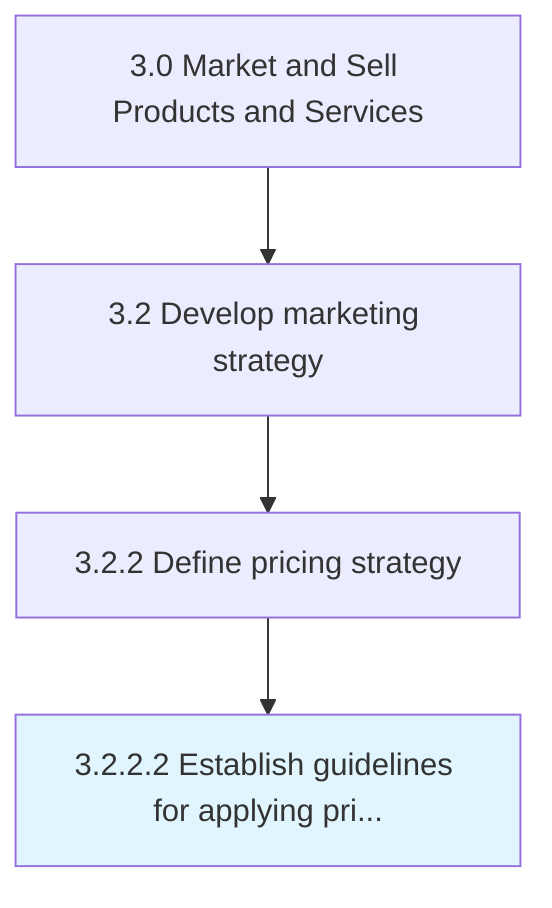

# Establish guidelines for applying pricing and discounting of products/services

> Creating a framework that allows for a uniform methodology while determining the price of individual offerings.

## Overview

Activity 3.2.2.2 is an activity within the Market and Sell Products and Services framework. 

Creating a framework that allows for a uniform methodology while determining the price of individual offerings. Devise a blueprint for establishing the pricing of specific products/services. Create guidelines that factor in the cost of production/servicing, price sensitivity, product lifecycle, and the price of competing/substitute products.

## Process Hierarchy



## Key Statistics

| Metric | Value |
|--------|-------|
| APQC Code | 10124 |
| Hierarchy ID | 3.2.2.2 |
| Level | Activity |
| Parent | [3.2.2](../) |
| Sub-Processes | 0 |


## GraphDL Semantic Structure

```
establish.Guidelines.for.ApplyingPricingAndDiscountingOfProductsservices
```

| Component | Value | Description |
|-----------|-------|-------------|
| Verb | `establish` | Primary action |
| Object | `guidelines` | Direct object |
| Preposition | `for` | Relationship |
| PrepObject | `applying pricing and discounting of products/services` | Indirect object |


## Related Concepts

- [Guidelines](/concepts/Guidelines)
- [ApplyingPricingOfProducts/Services](/concepts/ApplyingPricingOfProducts/Services)
- [Guidelines](/concepts/Guidelines)
- [DiscountingOfProducts/Services](/concepts/DiscountingOfProducts/Services)


---

*Source: APQC PCF 10124 (3.2.2.2) - APQC*
