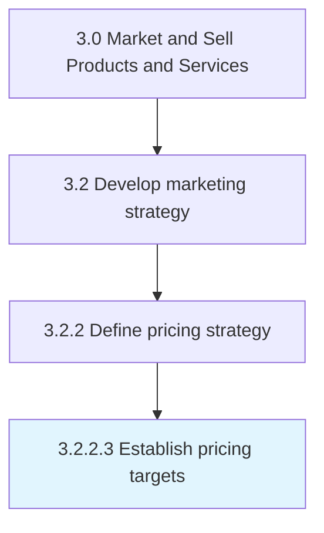

# Establish pricing targets

> Determining optimum prices for individual products or services on the basis of the cost of producing, distributing and marketing the offerings, pricing analysis and general pricing strategy.

## Overview

Activity 3.2.2.3 is an activity within the Market and Sell Products and Services framework. 

Determining optimum prices for individual products or services on the basis of the cost of producing, distributing and marketing the offerings, pricing analysis and general pricing strategy.

## Process Hierarchy



## Key Statistics

| Metric | Value |
|--------|-------|
| APQC Code | 19999 |
| Hierarchy ID | 3.2.2.3 |
| Level | Activity |
| Parent | [3.2.2](../) |
| Sub-Processes | 0 |


## GraphDL Semantic Structure

```
establish.PricingTargets
```

| Component | Value | Description |
|-----------|-------|-------------|
| Verb | `establish` | Primary action |
| Object | `pricing targets` | Direct object |


## Related Concepts

- PricingTargets


---

*Source: APQC PCF 19999 (3.2.2.3) - APQC*
