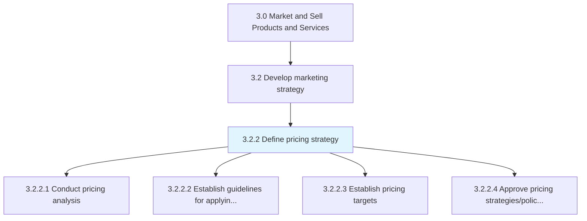
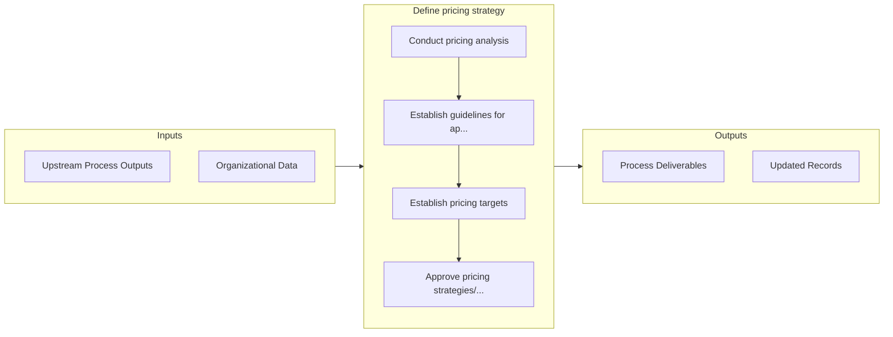

# Define pricing strategy

> Creating a pricing strategy and mechanism that aligns with the benefits of the products/services, as perceived by customers.

## Overview

Process 3.2.2 is a core process that defines the specific procedures for define pricing strategy. 

Creating a pricing strategy and mechanism that aligns with the benefits of the products/services, as perceived by customers. Chart a strategic course and a methodology that can guide the pricing of products/services. Draw heavily from the customer value proposition, and balance the expectations of different divisions inside the organization, while delivering the maximum ROI.

## Process Hierarchy



## Key Statistics

| Metric | Value |
|--------|-------|
| APQC Code | 10123 |
| Hierarchy ID | 3.2.2 |
| Level | Process |
| Parent | [3.2](../) |
| Sub-Processes | 4 |


## GraphDL Semantic Structure

```
define.PricingStrategy
```

| Component | Value | Description |
|-----------|-------|-------------|
| Verb | `define` | Primary action |
| Object | `pricing strategy` | Direct object |


## Process Flow



## Sub-Processes

| Process | Hierarchy ID | Description |
|---------|-------------|-------------|
| [Conduct pricing analysis](./ConductPricingAnalysis) | 3.2.2.1 | Analyzing marketing objectives, consumer demand, product attributes, competitors' pricing, and econo |
| [Establish guidelines for applying pricing and discounting of products/services](./EstablishGuidelinesForApplyingPricingAndDiscountingOfProductsservices) | 3.2.2.2 | Creating a framework that allows for a uniform methodology while determining the price of individual |
| [Establish pricing targets](./EstablishPricingTargets) | 3.2.2.3 | Determining optimum prices for individual products or services on the basis of the cost of producing |
| [Approve pricing strategies/policies and targets](./ApprovePricingStrategiespoliciesAndTargets) | 3.2.2.4 | Confirming the strategy and specifications developed for pricing the organization's products/service |


## Related Concepts

- [PricingStrategy](/concepts/PricingStrategy)


---

*Source: APQC PCF 10123 (3.2.2) - APQC*
