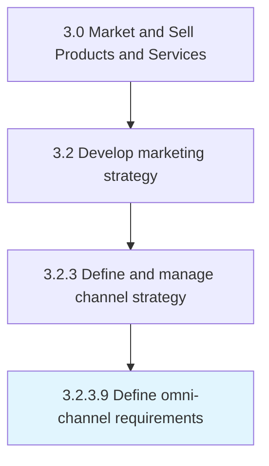

# Define omni-channel requirements

> Identifying necessary preconditions that a channel should fulfill in order to be included as one of the adopted channels, such as required throughput capacities, service capabilities, competitive pricing, and alignment with organizational marketing strategies.

## Overview

Activity 3.2.3.9 is an activity within the Market and Sell Products and Services framework. 

Identifying necessary preconditions that a channel should fulfill in order to be included as one of the adopted channels, such as required throughput capacities, service capabilities, competitive pricing, and alignment with organizational marketing strategies.

## Process Hierarchy



## Key Statistics

| Metric | Value |
|--------|-------|
| APQC Code | 16591 |
| Hierarchy ID | 3.2.3.9 |
| Level | Activity |
| Parent | [3.2.3](../) |
| Sub-Processes | 0 |


## GraphDL Semantic Structure

```
define.OmnichannelRequirements
```

| Component | Value | Description |
|-----------|-------|-------------|
| Verb | `define` | Primary action |
| Object | `omni-channel requirements` | Direct object |


---

*Source: APQC PCF 16591 (3.2.3.9) - APQC*
