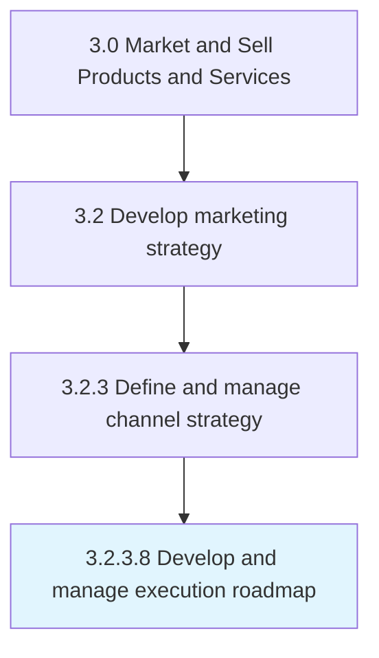

# Define omni-channel strategy

> Devising a strategy to market company's products or services seamlessly through all or most channels that are in widespread use among the target market.

## Overview

Activity 3.2.3.8 is an activity within the Market and Sell Products and Services framework. 

Devising a strategy to market company's products or services seamlessly through all or most channels that are in widespread use among the target market. This may mean cross-channel access to customer preferences and purchasing history to accept returned merchandise, provide refunds, resolve payment issues or to provide technical support.

## Process Hierarchy



## Key Statistics

| Metric | Value |
|--------|-------|
| APQC Code | 16590 |
| Hierarchy ID | 3.2.3.8 |
| Level | Activity |
| Parent | [3.2.3](../) |
| Sub-Processes | 0 |


## GraphDL Semantic Structure

```
define.OmnichannelStrategy
```

| Component | Value | Description |
|-----------|-------|-------------|
| Verb | `define` | Primary action |
| Object | `omni-channel strategy` | Direct object |


---

*Source: APQC PCF 16590 (3.2.3.8) - APQC*
