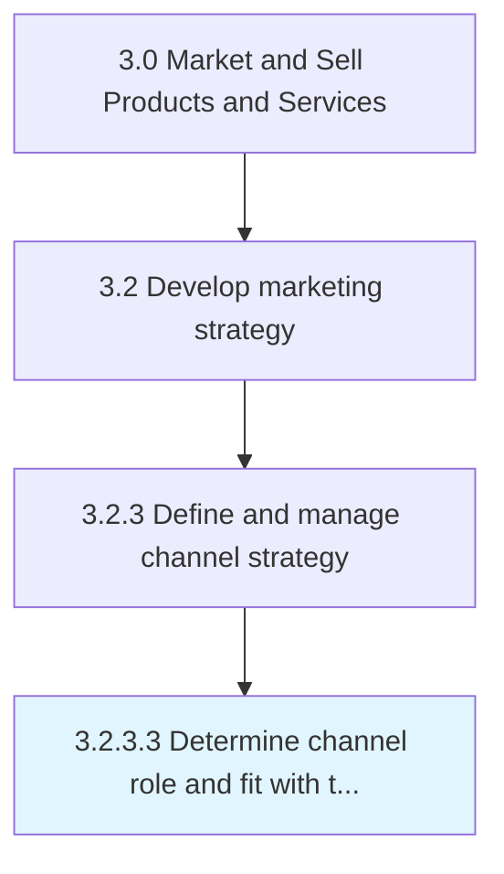

# Determine channel role and fit with target segments

> Analyze the various channels for their relevance to the targeted segments.

## Overview

Activity 3.2.3.3 is an activity within the Market and Sell Products and Services framework. 

Analyze the various channels for their relevance to the targeted segments. Identify the channel that can effectively market to the targeted customers in regard to the drives, desires, and characteristics of these populations, their uptake, extent of engagement, frequency of use, and effectiveness in communicating.

## Process Hierarchy



## Key Statistics

| Metric | Value |
|--------|-------|
| APQC Code | 10127 |
| Hierarchy ID | 3.2.3.3 |
| Level | Activity |
| Parent | [3.2.3](../) |
| Sub-Processes | 0 |


## GraphDL Semantic Structure

```
determine.ChannelRoleAndFit.with.TargetSegments
```

| Component | Value | Description |
|-----------|-------|-------------|
| Verb | `determine` | Primary action |
| Object | `channel role and fit` | Direct object |
| Preposition | `with` | Relationship |
| PrepObject | `target segments` | Indirect object |


## Related Concepts

- [ChannelRole](/concepts/ChannelRole)
- [TargetSegments](/concepts/TargetSegments)
- [Fit](/concepts/Fit)
- [TargetSegments](/concepts/TargetSegments)


---

*Source: APQC PCF 10127 (3.2.3.3) - APQC*
