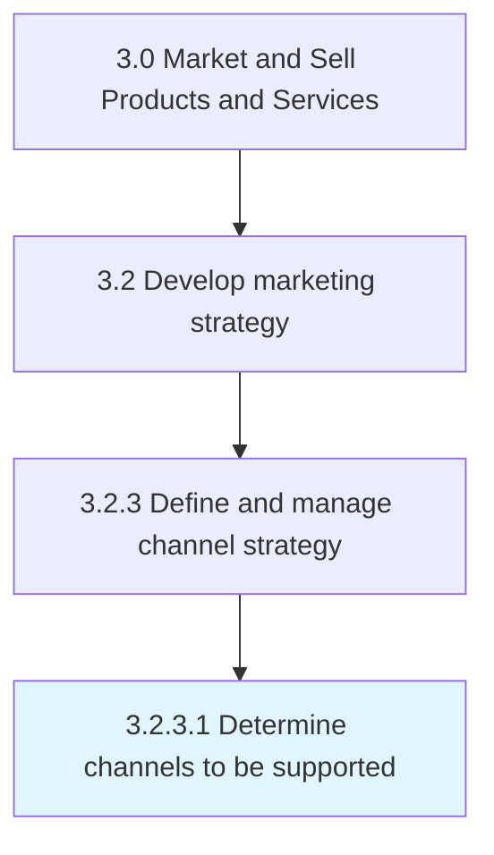

# Determine channels to be supported

> Deciding which distributors, wholesalers and retailers the company will use to promote its offerings and to distribute its products and services to the target market.

## Overview

Activity 3.2.3.1 is an activity within the Market and Sell Products and Services framework. 

Deciding which distributors, wholesalers and retailers the company will use to promote its offerings and to distribute its products and services to the target market. Narrowing down which intermediaries the company will use will affect retail prices of individual products, and should therefore be included in the pricing analysis.

## Process Hierarchy



## Key Statistics

| Metric | Value |
|--------|-------|
| APQC Code | 20001 |
| Hierarchy ID | 3.2.3.1 |
| Level | Activity |
| Parent | [3.2.3](../) |
| Sub-Processes | 0 |


## GraphDL Semantic Structure

```
determine.Channels.to.BeSupported
```

| Component | Value | Description |
|-----------|-------|-------------|
| Verb | `determine` | Primary action |
| Object | `channels` | Direct object |
| Preposition | `to` | Relationship |
| PrepObject | `be supported` | Indirect object |


## Related Concepts

- [Channels](/concepts/Channels)
- [BeSupported](/concepts/BeSupported)


---

*Source: APQC PCF 20001 (3.2.3.1) - APQC*
