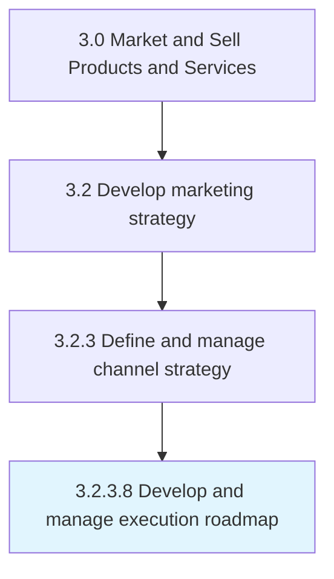

# Develop and manage execution roadmap

> Determining the actions that need to be taken for successful multichannel marketing, the ordering, timing and dependencies of the steps, and the governance mechanism for reviewing and changing the protocol, if needed.

## Overview

Activity 3.2.3.8 is an activity within the Market and Sell Products and Services framework. 

Determining the actions that need to be taken for successful multichannel marketing, the ordering, timing and dependencies of the steps, and the governance mechanism for reviewing and changing the protocol, if needed.

## Process Hierarchy



## Key Statistics

| Metric | Value |
|--------|-------|
| APQC Code | 20005 |
| Hierarchy ID | 3.2.3.8 |
| Level | Activity |
| Parent | [3.2.3](../) |
| Sub-Processes | 0 |


## GraphDL Semantic Structure

```
develop.AndManageExecutionRoadmap
```

| Component | Value | Description |
|-----------|-------|-------------|
| Verb | `develop` | Primary action |
| Object | `and manage execution roadmap` | Direct object |


## Related Concepts

- [ExecutionRoadmap](/concepts/ExecutionRoadmap)
- [ExecutionRoadmap](/concepts/ExecutionRoadmap)


---

*Source: APQC PCF 20005 (3.2.3.8) - APQC*
