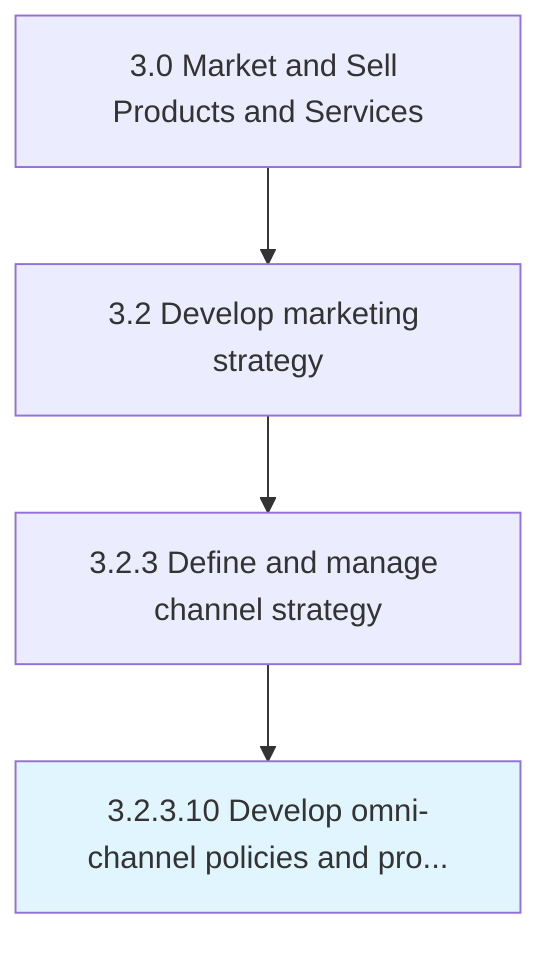

# Develop omni-channel policies and procedures

> Determining the detailed policies and procedures that each of the channels needs to follow in order to conform to the organizational marketing strategy and to provide seamless customer service experience.

## Overview

Activity 3.2.3.10 is an activity within the Market and Sell Products and Services framework. 

Determining the detailed policies and procedures that each of the channels needs to follow in order to conform to the organizational marketing strategy and to provide seamless customer service experience.

## Process Hierarchy



## Key Statistics

| Metric | Value |
|--------|-------|
| APQC Code | 16592 |
| Hierarchy ID | 3.2.3.10 |
| Level | Activity |
| Parent | [3.2.3](../) |
| Sub-Processes | 0 |


## GraphDL Semantic Structure

```
develop.OmnichannelPoliciesAndProcedures
```

| Component | Value | Description |
|-----------|-------|-------------|
| Verb | `develop` | Primary action |
| Object | `omni-channel policies and procedures` | Direct object |


---

*Source: APQC PCF 16592 (3.2.3.10) - APQC*
