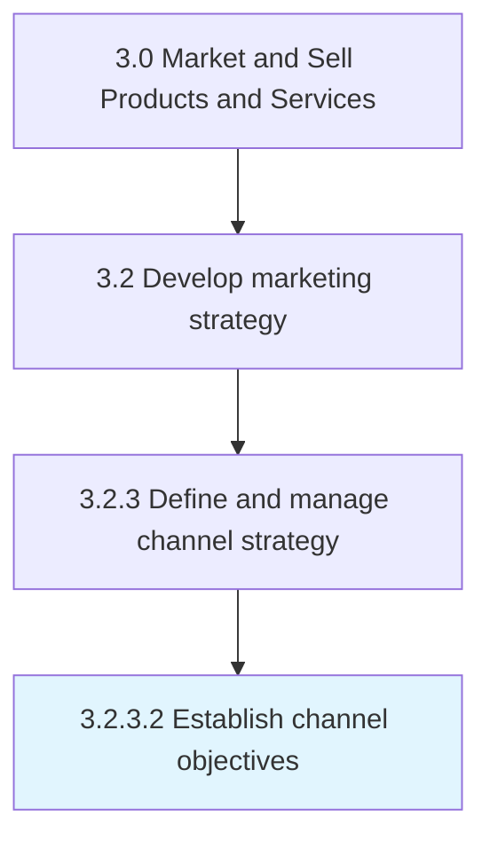

# Establish channel objectives

> Identifying the role that each chosen marketing channels plays in the larger distribution network with respect to the organizational marketing strategy.

## Overview

Activity 3.2.3.2 is an activity within the Market and Sell Products and Services framework. 

Identifying the role that each chosen marketing channels plays in the larger distribution network with respect to the organizational marketing strategy. Determine intermediary costs for shipping, handling, transporting, warehousing, insurance and marketing that incur and accumulate in the distribution channel.

## Process Hierarchy



## Key Statistics

| Metric | Value |
|--------|-------|
| APQC Code | 20002 |
| Hierarchy ID | 3.2.3.2 |
| Level | Activity |
| Parent | [3.2.3](../) |
| Sub-Processes | 0 |


## GraphDL Semantic Structure

```
establish.ChannelObjectives
```

| Component | Value | Description |
|-----------|-------|-------------|
| Verb | `establish` | Primary action |
| Object | `channel objectives` | Direct object |


## Related Concepts

- [ChannelObjectives](/concepts/ChannelObjectives)


---

*Source: APQC PCF 20002 (3.2.3.2) - APQC*
