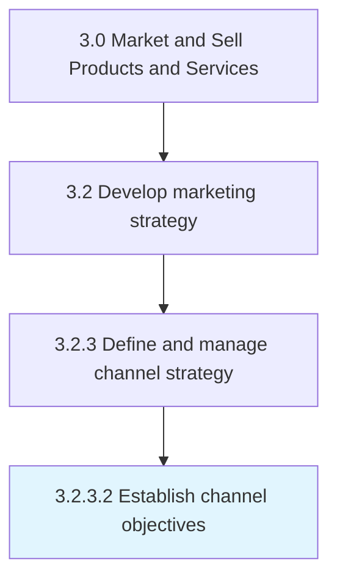

# Establish channel objectives

> Identifying the role that each chosen marketing channels plays in the larger distribution network with respect to the organizational marketing strategy.

## Overview

Activity 3.2.3.2 is an activity within the Market and Sell Products and Services framework.

Identifying the role that each chosen marketing channels plays in the larger distribution network with respect to the organizational marketing strategy. Determine intermediary costs for shipping, handling, transporting, warehousing, insurance and marketing that incur and accumulate in the distribution channel.

This process is critical to effective sales and marketing execution. It ensures that activities are systematically planned, executed, and measured against organizational objectives. When performed effectively, this process drives revenue growth, enhances customer engagement, and strengthens competitive positioning in target markets.

## Process Hierarchy



## Key Statistics

| Metric | Value |
|--------|-------|
| APQC Code | 20002 |
| Hierarchy ID | 3.2.3.2 |
| Level | Activity |
| Parent | [3.2.3](../) |
| Sub-Processes | 0 |

## Process Flow


## GraphDL Semantic Structure

```
establish.ChannelObjectives
```

| Component | Value | Description |
|-----------|-------|-------------|
| Verb | `establish` | Primary action |
| Object | `channel objectives` | Direct object |


## RACI Matrix

| Role | Responsible | Accountable | Consulted | Informed |
|------|:-----------:|:-----------:|:---------:|:--------:|
| Marketing Manager | R |  |  |  |
| CMO / VP Marketing |  | A |  |  |
| Sales Manager |  |  | C |  |
| Product Manager |  |  | C |  |
| Finance Manager |  |  |  | I |

## Related Occupations

- [Marketing Managers](/occupations/Management/MarketingManagers)
- [Advertising And Promotions Managers](/occupations/Management/AdvertisingAndPromotionsManagers)
- [Market Research Analysts](/occupations/Business-and-Financial-Operations/MarketResearchAnalysts)
- [Public Relations Specialists](/occupations/Media-and-Communication/PublicRelationsSpecialists)
- [Sales Managers](/occupations/Management/SalesManagers)

## Related Departments

- [Marketing](/departments/Marketing)
- [Product Management](/departments/ProductManagement)
- [Sales](/departments/Sales)

## Industry Variations

### Consumer Products

In consumer products, establish channel objectives centers on brand positioning across multiple product lines, seasonal marketing calendars, and trade marketing strategies.

### Technology

In technology, establish channel objectives emphasizes digital-first strategies, developer community engagement, and product-led growth approaches.

### Life Sciences

In life sciences, establish channel objectives must comply with FDA advertising regulations, focus on HCP engagement, and navigate complex approval processes for promotional materials.

## KPIs & Metrics

| Metric | Description | Target |
|--------|-------------|--------|
| Brand Awareness | Percentage of target market aware of brand and value proposition | >60% |
| Channel ROI | Return on investment across marketing channels | >3:1 |
| Customer Acquisition Cost (CAC) | Average cost to acquire a new customer | Below industry benchmark |
| Marketing Qualified Leads (MQLs) | Number of qualified leads generated by marketing | Quarter-over-quarter growth |

## Related Concepts

- ChannelObjectives

---

*Source: APQC PCF 20002 (3.2.3.2) - APQC*
