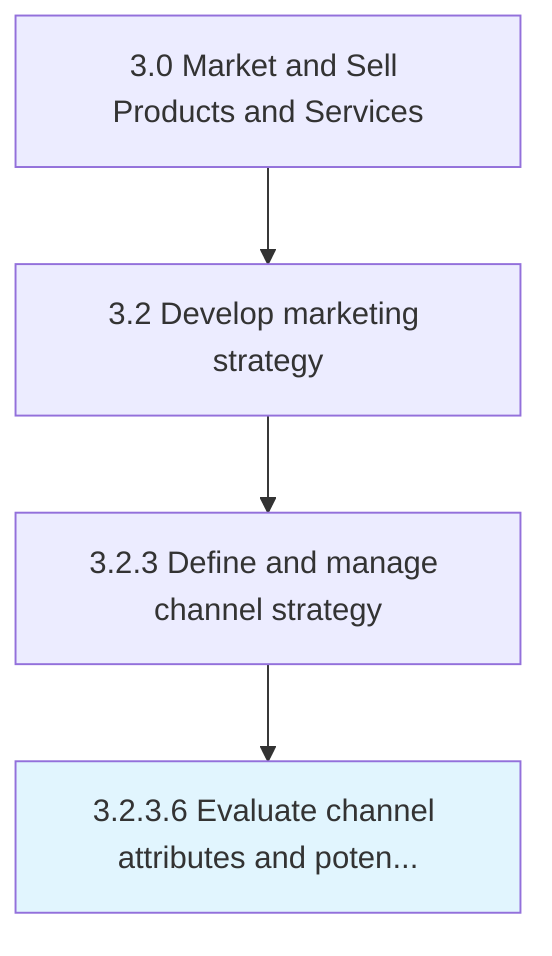

# Evaluate channel attributes and potential partners

> Assessing the attributes of all marketing channels, and evaluating the key partners in those channels.

## Overview

Activity 3.2.3.6 is an activity within the Market and Sell Products and Services framework. 

Assessing the attributes of all marketing channels, and evaluating the key partners in those channels. Closely examine the various characteristics of all available marketing channels such as the cost of using them, durability of impact, applicability to the organization's products/services, turn-around time, involvement of middlemen, and conversion rate. Analyze key partners in the marketing channels including those who have been associated with the organization; evaluate their capabilities, the scale and scope of their operations, quality of support provided, etc.

## Process Hierarchy



## Key Statistics

| Metric | Value |
|--------|-------|
| APQC Code | 10126 |
| Hierarchy ID | 3.2.3.6 |
| Level | Activity |
| Parent | [3.2.3](../) |
| Sub-Processes | 0 |


## GraphDL Semantic Structure

```
evaluate.ChannelAttributesAndPotentialPartners
```

| Component | Value | Description |
|-----------|-------|-------------|
| Verb | `evaluate` | Primary action |
| Object | `channel attributes and potential partners` | Direct object |


## Related Concepts

- ChannelAttributesPartners
- PotentialPartners


---

*Source: APQC PCF 10126 (3.2.3.6) - APQC*
