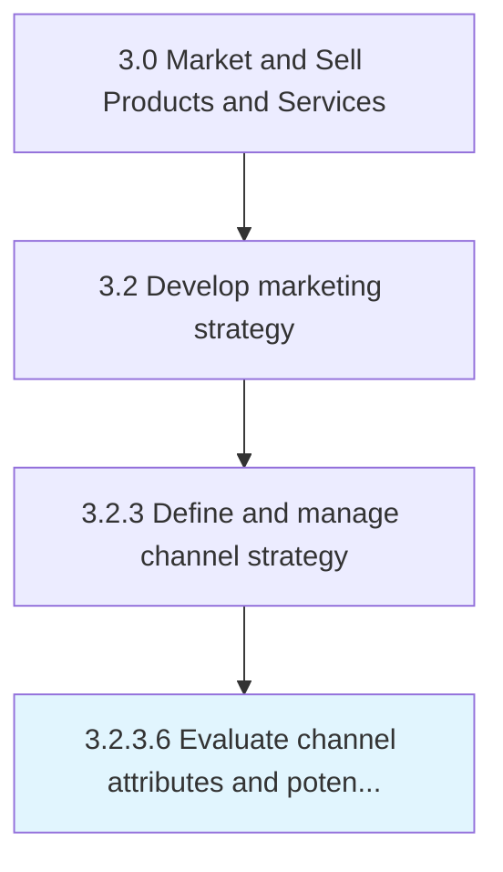
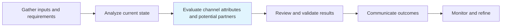

# Evaluate channel attributes and potential partners

> Assessing the attributes of all marketing channels, and evaluating the key partners in those channels.

## Overview

Activity 3.2.3.6 is an activity within the Market and Sell Products and Services framework.

Assessing the attributes of all marketing channels, and evaluating the key partners in those channels. Closely examine the various characteristics of all available marketing channels such as the cost of using them, durability of impact, applicability to the organization's products/services, turn-around time, involvement of middlemen, and conversion rate. Analyze key partners in the marketing channels including those who have been associated with the organization; evaluate their capabilities, the scale and scope of their operations, quality of support provided, etc.

This process is critical to effective sales and marketing execution. It ensures that activities are systematically planned, executed, and measured against organizational objectives. When performed effectively, this process drives revenue growth, enhances customer engagement, and strengthens competitive positioning in target markets.

## Process Hierarchy



## Key Statistics

| Metric | Value |
|--------|-------|
| APQC Code | 10126 |
| Hierarchy ID | 3.2.3.6 |
| Level | Activity |
| Parent | [3.2.3](../) |
| Sub-Processes | 0 |

## Process Flow



## GraphDL Semantic Structure

```
evaluate.ChannelAttributesAndPotentialPartners
```

| Component | Value | Description |
|-----------|-------|-------------|
| Verb | `evaluate` | Primary action |
| Object | `channel attributes and potential partners` | Direct object |


## RACI Matrix

| Role | Responsible | Accountable | Consulted | Informed |
|------|:-----------:|:-----------:|:---------:|:--------:|
| Marketing Manager | R |  |  |  |
| CMO / VP Marketing |  | A |  |  |
| Sales Manager |  |  | C |  |
| Product Manager |  |  | C |  |
| Finance Manager |  |  |  | I |

## Related Occupations

- [Marketing Managers](/occupations/Management/MarketingManagers)
- [Advertising And Promotions Managers](/occupations/Management/AdvertisingAndPromotionsManagers)
- [Market Research Analysts](/occupations/Business-and-Financial-Operations/MarketResearchAnalysts)
- [Public Relations Specialists](/occupations/Media-and-Communication/PublicRelationsSpecialists)
- [Sales Managers](/occupations/Management/SalesManagers)

## Related Departments

- [Marketing](/departments/Marketing)
- [Product Management](/departments/ProductManagement)
- [Sales](/departments/Sales)

## Industry Variations

### Consumer Products

In consumer products, evaluate channel attributes and potential partners centers on brand positioning across multiple product lines, seasonal marketing calendars, and trade marketing strategies.

### Technology

In technology, evaluate channel attributes and potential partners emphasizes digital-first strategies, developer community engagement, and product-led growth approaches.

### Life Sciences

In life sciences, evaluate channel attributes and potential partners must comply with FDA advertising regulations, focus on HCP engagement, and navigate complex approval processes for promotional materials.

## KPIs & Metrics

| Metric | Description | Target |
|--------|-------------|--------|
| Brand Awareness | Percentage of target market aware of brand and value proposition | >60% |
| Channel ROI | Return on investment across marketing channels | >3:1 |
| Customer Acquisition Cost (CAC) | Average cost to acquire a new customer | Below industry benchmark |
| Marketing Qualified Leads (MQLs) | Number of qualified leads generated by marketing | Quarter-over-quarter growth |

## Related Concepts

- ChannelAttributesPartners
- PotentialPartners

---

*Source: APQC PCF 10126 (3.2.3.6) - APQC*
