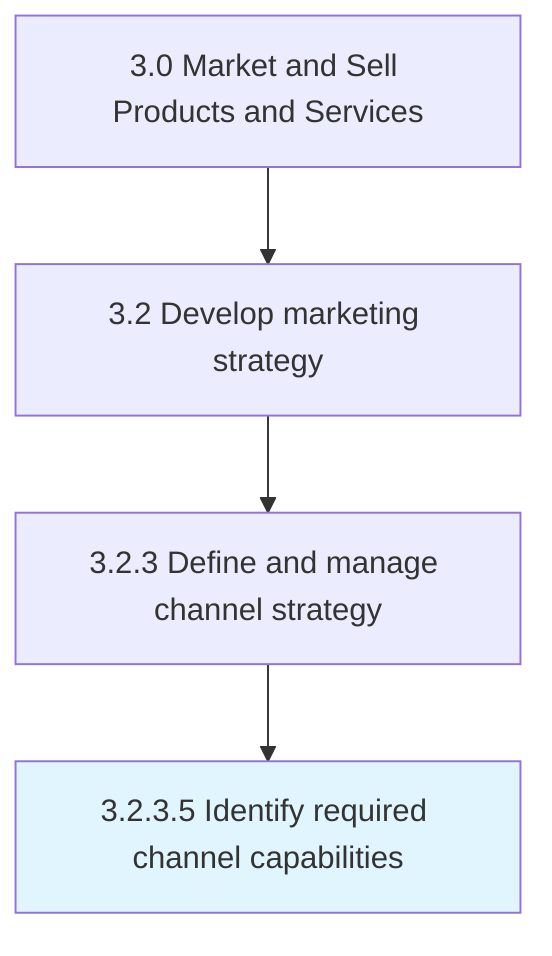

# Identify required channel capabilities

> Determining the maximum output rate required from a distribution channel to optimally market and deliver the products and services the company offers or would like to offer.

## Overview

Activity 3.2.3.5 is an activity within the Market and Sell Products and Services framework. 

Determining the maximum output rate required from a distribution channel to optimally market and deliver the products and services the company offers or would like to offer. Ideally, a channel should be able to adapt to a certain degree of variability in the demand for the offerings, and able scale up if needed.

## Process Hierarchy



## Key Statistics

| Metric | Value |
|--------|-------|
| APQC Code | 20003 |
| Hierarchy ID | 3.2.3.5 |
| Level | Activity |
| Parent | [3.2.3](../) |
| Sub-Processes | 0 |


## GraphDL Semantic Structure

```
identify.RequiredChannelCapabilities
```

| Component | Value | Description |
|-----------|-------|-------------|
| Verb | `identify` | Primary action |
| Object | `required channel capabilities` | Direct object |


## Related Concepts

- [RequiredChannelCapabilities](/concepts/RequiredChannelCapabilities)


---

*Source: APQC PCF 20003 (3.2.3.5) - APQC*
