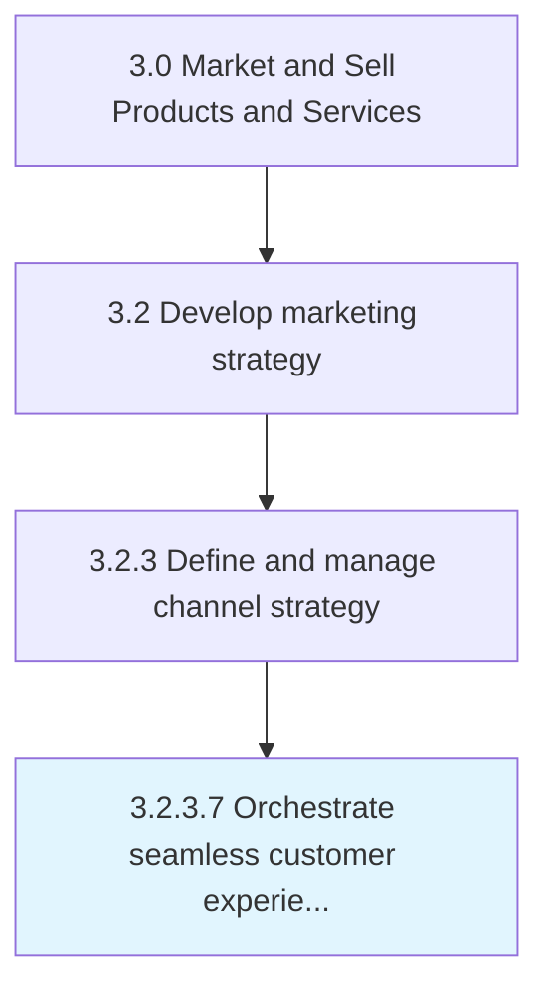
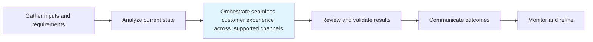

# Orchestrate seamless customer experience across supported channels

> Coordinating marketing and distribution efforts across different channels that integrate well with each other, are in conformance with company values, visual identity and branding, and offer uniform customer service experience that drives customer loyalty and repeat business.

## Overview

Activity 3.2.3.7 is an activity within the Market and Sell Products and Services framework.

Coordinating marketing and distribution efforts across different channels that integrate well with each other, are in conformance with company values, visual identity and branding, and offer uniform customer service experience that drives customer loyalty and repeat business.

This process is critical to effective sales and marketing execution. It ensures that activities are systematically planned, executed, and measured against organizational objectives. When performed effectively, this process drives revenue growth, enhances customer engagement, and strengthens competitive positioning in target markets.

## Process Hierarchy



## Key Statistics

| Metric | Value |
|--------|-------|
| APQC Code | 20004 |
| Hierarchy ID | 3.2.3.7 |
| Level | Activity |
| Parent | [3.2.3](../) |
| Sub-Processes | 0 |

## Process Flow



## GraphDL Semantic Structure

```
orchestrate.SeamlessCustomerExperience.across.SupportedChannels
```

| Component | Value | Description |
|-----------|-------|-------------|
| Verb | `orchestrate` | Primary action |
| Object | `seamless customer experience` | Direct object |
| Preposition | `across` | Relationship |
| PrepObject | `supported channels` | Indirect object |


## RACI Matrix

| Role | Responsible | Accountable | Consulted | Informed |
|------|:-----------:|:-----------:|:---------:|:--------:|
| Marketing Manager | R |  |  |  |
| CMO / VP Marketing |  | A |  |  |
| Sales Manager |  |  | C |  |
| Product Manager |  |  | C |  |
| Finance Manager |  |  |  | I |

## Related Occupations

- [Marketing Managers](/occupations/Management/MarketingManagers)
- [Advertising And Promotions Managers](/occupations/Management/AdvertisingAndPromotionsManagers)
- [Market Research Analysts](/occupations/Business-and-Financial-Operations/MarketResearchAnalysts)
- [Public Relations Specialists](/occupations/Media-and-Communication/PublicRelationsSpecialists)
- [Sales Managers](/occupations/Management/SalesManagers)

## Related Departments

- [Marketing](/departments/Marketing)
- [Product Management](/departments/ProductManagement)
- [Sales](/departments/Sales)

## Industry Variations

### Consumer Products

In consumer products, orchestrate seamless customer experience across supported channels centers on brand positioning across multiple product lines, seasonal marketing calendars, and trade marketing strategies.

### Technology

In technology, orchestrate seamless customer experience across supported channels emphasizes digital-first strategies, developer community engagement, and product-led growth approaches.

### Life Sciences

In life sciences, orchestrate seamless customer experience across supported channels must comply with FDA advertising regulations, focus on HCP engagement, and navigate complex approval processes for promotional materials.

## KPIs & Metrics

| Metric | Description | Target |
|--------|-------------|--------|
| Brand Awareness | Percentage of target market aware of brand and value proposition | >60% |
| Channel ROI | Return on investment across marketing channels | >3:1 |
| Customer Acquisition Cost (CAC) | Average cost to acquire a new customer | Below industry benchmark |
| Marketing Qualified Leads (MQLs) | Number of qualified leads generated by marketing | Quarter-over-quarter growth |

## Related Concepts

- SeamlessCustomerExperience
- SupportedChannels

---

*Source: APQC PCF 20004 (3.2.3.7) - APQC*
