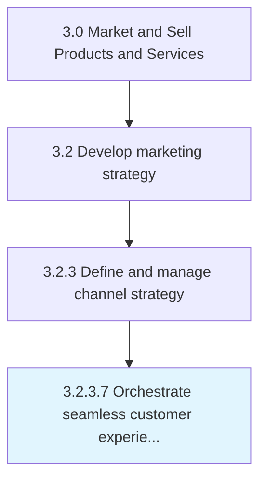

# Orchestrate seamless customer experience across supported channels

> Coordinating marketing and distribution efforts across different channels that integrate well with each other, are in conformance with company values, visual identity and branding, and offer uniform customer service experience that drives customer loyalty and repeat business.

## Overview

Activity 3.2.3.7 is an activity within the Market and Sell Products and Services framework. 

Coordinating marketing and distribution efforts across different channels that integrate well with each other, are in conformance with company values, visual identity and branding, and offer uniform customer service experience that drives customer loyalty and repeat business.

## Process Hierarchy



## Key Statistics

| Metric | Value |
|--------|-------|
| APQC Code | 20004 |
| Hierarchy ID | 3.2.3.7 |
| Level | Activity |
| Parent | [3.2.3](../) |
| Sub-Processes | 0 |


## GraphDL Semantic Structure

```
orchestrate.SeamlessCustomerExperience.across.SupportedChannels
```

| Component | Value | Description |
|-----------|-------|-------------|
| Verb | `orchestrate` | Primary action |
| Object | `seamless customer experience` | Direct object |
| Preposition | `across` | Relationship |
| PrepObject | `supported channels` | Indirect object |


## Related Concepts

- [SeamlessCustomerExperience](/concepts/SeamlessCustomerExperience)
- [SupportedChannels](/concepts/SupportedChannels)


---

*Source: APQC PCF 20004 (3.2.3.7) - APQC*
