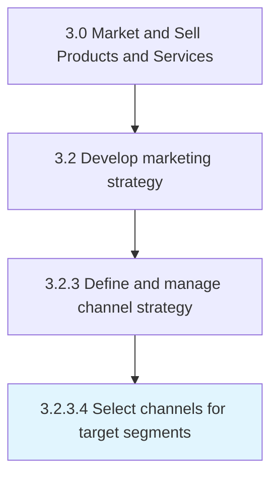

# Select channels for target segments

> Choose the most pertinent marketing channel for the targeted segments (based on Determine channel fit with target segments [10127]).

## Overview

Activity 3.2.3.4 is an activity within the Market and Sell Products and Services framework. 

Choose the most pertinent marketing channel for the targeted segments (based on Determine channel fit with target segments [10127]).

## Process Hierarchy



## Key Statistics

| Metric | Value |
|--------|-------|
| APQC Code | 10128 |
| Hierarchy ID | 3.2.3.4 |
| Level | Activity |
| Parent | [3.2.3](../) |
| Sub-Processes | 0 |


## GraphDL Semantic Structure

```
select.Channels.for.TargetSegments
```

| Component | Value | Description |
|-----------|-------|-------------|
| Verb | `select` | Primary action |
| Object | `channels` | Direct object |
| Preposition | `for` | Relationship |
| PrepObject | `target segments` | Indirect object |


## Related Concepts

- Channels
- TargetSegments


---

*Source: APQC PCF 10128 (3.2.3.4) - APQC*
