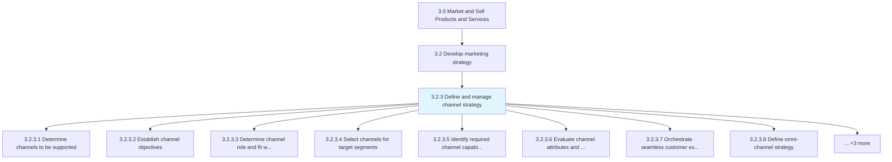
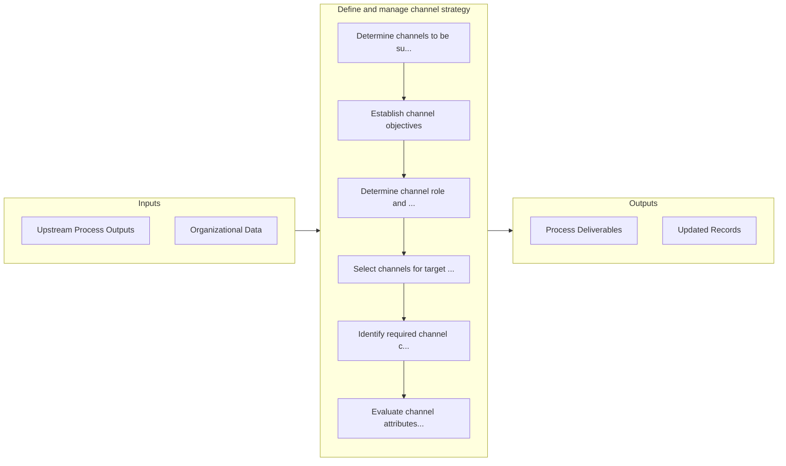

# Define and manage channel strategy

> Establishing all the activities needed to identify the appropriate channels to market to different customer segments as defined in Determine target segments [10117].

## Overview

Process 3.2.3 is a core process that defines the specific procedures for define and manage channel strategy. 

Establishing all the activities needed to identify the appropriate channels to market to different customer segments as defined in Determine target segments [10117]. This involves finding channel partners, ensuring that the channels align with organizational strategy for each segment, and the final channel selection process.

## Process Hierarchy



## Key Statistics

| Metric | Value |
|--------|-------|
| APQC Code | 20000 |
| Hierarchy ID | 3.2.3 |
| Level | Process |
| Parent | [3.2](../) |
| Sub-Processes | 11 |


## GraphDL Semantic Structure

```graphdl
define.AndManageChannelStrategy
```

| Component | Value | Description |
|-----------|-------|-------------|
| Verb | `define` | Primary action |
| Object | `and manage channel strategy` | Direct object |


## Process Flow



## Sub-Processes

| Process | Hierarchy ID | Description |
|---------|-------------|-------------|
| [Determine channels to be supported](./DetermineChannelsToBeSupported) | 3.2.3.1 | Deciding which distributors, wholesalers and retailers the company will use to promote its offerings |
| [Establish channel objectives](./EstablishChannelObjectives) | 3.2.3.2 | Identifying the role that each chosen marketing channels plays in the larger distribution network wi |
| [Determine channel role and fit with target segments](./DetermineChannelRoleAndFitWithTargetSegments) | 3.2.3.3 | Analyze the various channels for their relevance to the targeted segments |
| [Select channels for target segments](./SelectChannelsForTargetSegments) | 3.2.3.4 | Choose the most pertinent marketing channel for the targeted segments (based on Determine channel fi |
| [Identify required channel capabilities](./IdentifyRequiredChannelCapabilities) | 3.2.3.5 | Determining the maximum output rate required from a distribution channel to optimally market and del |
| [Evaluate channel attributes and potential partners](./EvaluateChannelAttributesAndPotentialPartners) | 3.2.3.6 | Assessing the attributes of all marketing channels, and evaluating the key partners in those channel |
| [Orchestrate seamless customer experience across supported channels](./OrchestrateSeamlessCustomerExperienceAcrossSupportedChannels) | 3.2.3.7 | Coordinating marketing and distribution efforts across different channels that integrate well with e |
| [Define omni-channel strategy](./DefineOmnichannelStrategy) | 3.2.3.8 | Devising a strategy to market company's products or services seamlessly through all or most channels |
| [Define omni-channel requirements](./DefineOmnichannelRequirements) | 3.2.3.9 | Identifying necessary preconditions that a channel should fulfill in order to be included as one of  |
| [Develop omni-channel policies and procedures](./DevelopOmnichannelPoliciesAndProcedures) | 3.2.3.10 | Determining the detailed policies and procedures that each of the channels needs to follow in order  |
| [Develop and manage execution roadmap](./DevelopAndManageExecutionRoadmap) | 3.2.3.8 | Determining the actions that need to be taken for successful multichannel marketing, the ordering, t |


## Related Concepts

- ChannelStrategy
- ChannelStrategy


---

*Source: APQC PCF 20000 (3.2.3) - APQC*
