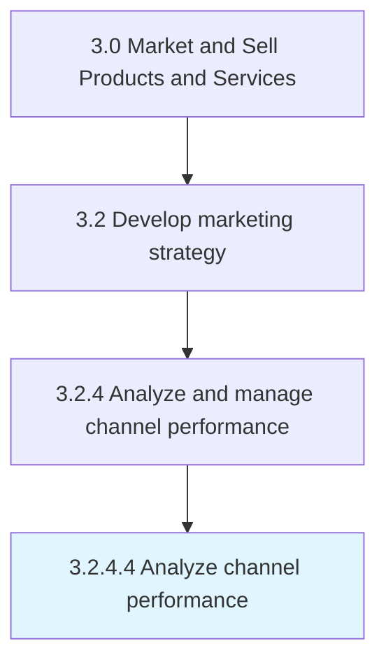

# Analyze channel performance

> Conducting an analysis to review channel performance with respect to chosen metrics, benchmarks and performance targets [16573].

## Overview

Activity 3.2.4.4 is an activity within the Market and Sell Products and Services framework. 

Conducting an analysis to review channel performance with respect to chosen metrics, benchmarks and performance targets [16573]. Compare to past performance and forecasts for the channel.

## Process Hierarchy



## Key Statistics

| Metric | Value |
|--------|-------|
| APQC Code | 16500 |
| Hierarchy ID | 3.2.4.4 |
| Level | Activity |
| Parent | [3.2.4](../) |
| Sub-Processes | 0 |


## GraphDL Semantic Structure

```
analyze.ChannelPerformance
```

| Component | Value | Description |
|-----------|-------|-------------|
| Verb | `analyze` | Primary action |
| Object | `channel performance` | Direct object |


## Related Concepts

- [ChannelPerformance](/concepts/ChannelPerformance)


---

*Source: APQC PCF 16500 (3.2.4.4) - APQC*
