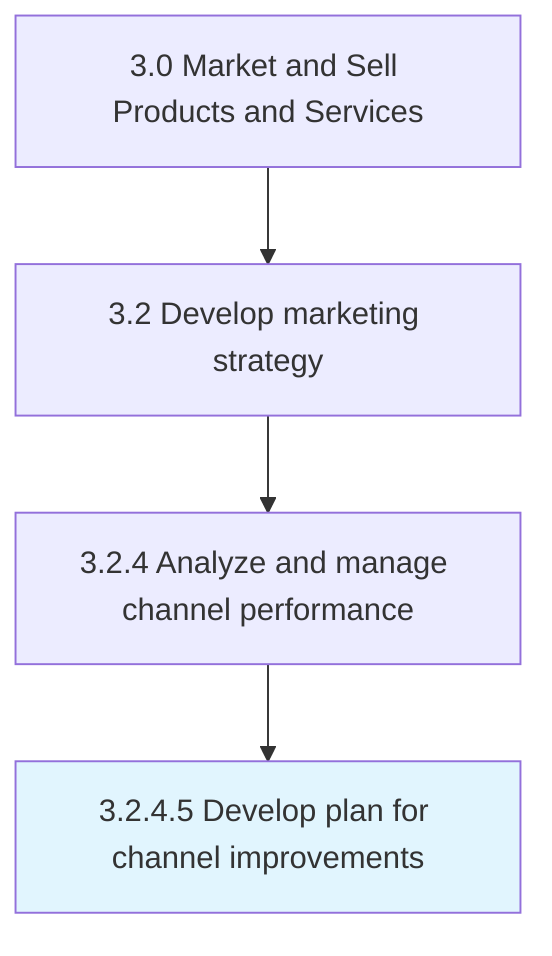

# Develop plan for channel improvements

> Devising a course of action to be taken to improve under-performing channels and to promote or expand channels that surpass expectations.

## Overview

Activity 3.2.4.5 is an activity within the Market and Sell Products and Services framework. 

Devising a course of action to be taken to improve under-performing channels and to promote or expand channels that surpass expectations.

## Process Hierarchy



## Key Statistics

| Metric | Value |
|--------|-------|
| APQC Code | 16501 |
| Hierarchy ID | 3.2.4.5 |
| Level | Activity |
| Parent | [3.2.4](../) |
| Sub-Processes | 0 |


## GraphDL Semantic Structure

```
develop.Plan.for.ChannelImprovements
```

| Component | Value | Description |
|-----------|-------|-------------|
| Verb | `develop` | Primary action |
| Object | `plan` | Direct object |
| Preposition | `for` | Relationship |
| PrepObject | `channel improvements` | Indirect object |


## Related Concepts

- Plan
- ChannelImprovements


---

*Source: APQC PCF 16501 (3.2.4.5) - APQC*
