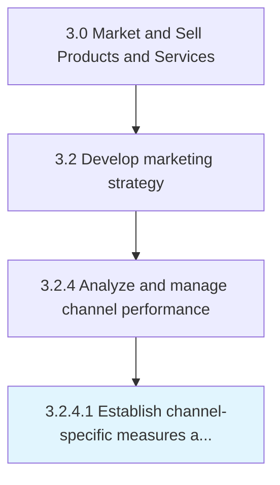

# Establish channel-specific measures and targets

> Determining measurable parameters to be used for comparing the performance of different marketing channels.

## Overview

Activity 3.2.4.1 is an activity within the Market and Sell Products and Services framework. 

Determining measurable parameters to be used for comparing the performance of different marketing channels. Decide on benchmarks and values for optimum or desired performance.

## Process Hierarchy



## Key Statistics

| Metric | Value |
|--------|-------|
| APQC Code | 16573 |
| Hierarchy ID | 3.2.4.1 |
| Level | Activity |
| Parent | [3.2.4](../) |
| Sub-Processes | 0 |


## GraphDL Semantic Structure

```
establish.ChannelspecificMeasuresAndTargets
```

| Component | Value | Description |
|-----------|-------|-------------|
| Verb | `establish` | Primary action |
| Object | `channel-specific measures and targets` | Direct object |


---

*Source: APQC PCF 16573 (3.2.4.1) - APQC*
