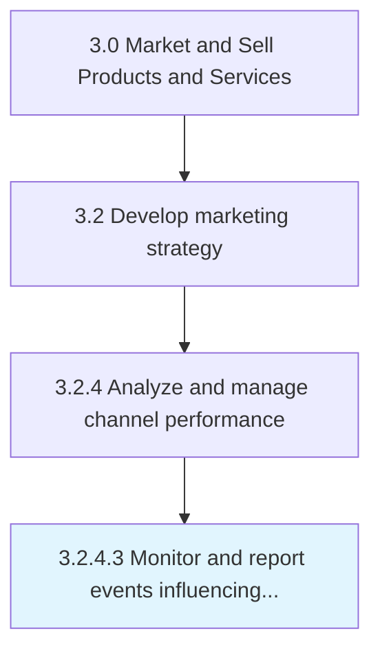

# Monitor and report events influencing factors

> Analyzing the factors and circumstances that influence desired outcomes.

## Overview

Activity 3.2.4.3 is an activity within the Market and Sell Products and Services framework. 

Analyzing the factors and circumstances that influence desired outcomes. Communicate core findings to relevant parties.

## Process Hierarchy



## Key Statistics

| Metric | Value |
|--------|-------|
| APQC Code | 16575 |
| Hierarchy ID | 3.2.4.3 |
| Level | Activity |
| Parent | [3.2.4](../) |
| Sub-Processes | 0 |


## GraphDL Semantic Structure

```
monitor.AndReportEventsInfluencingFactors
```

| Component | Value | Description |
|-----------|-------|-------------|
| Verb | `monitor` | Primary action |
| Object | `and report events influencing factors` | Direct object |


## Related Concepts

- [EventsInfluencingFactors](/concepts/EventsInfluencingFactors)
- [EventsInfluencingFactors](/concepts/EventsInfluencingFactors)


---

*Source: APQC PCF 16575 (3.2.4.3) - APQC*
