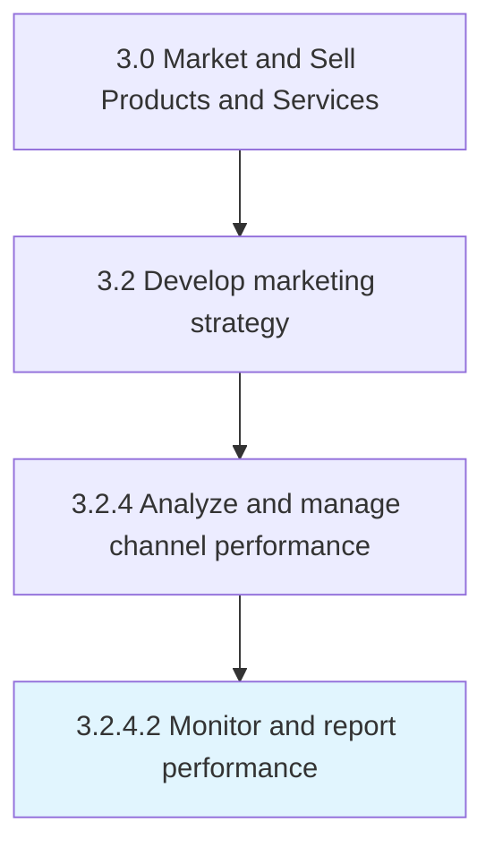

# Monitor and report performance

> Tracking trends and changes in performance inside individual marketing channels and in channels collectively.

## Overview

Activity 3.2.4.2 is an activity within the Market and Sell Products and Services framework. 

Tracking trends and changes in performance inside individual marketing channels and in channels collectively. Summarize and document results. Alert relevant parties about significant or unexpected deviations from expected behaviors.

## Process Hierarchy



## Key Statistics

| Metric | Value |
|--------|-------|
| APQC Code | 16574 |
| Hierarchy ID | 3.2.4.2 |
| Level | Activity |
| Parent | [3.2.4](../) |
| Sub-Processes | 0 |


## GraphDL Semantic Structure

```
monitor.AndReportPerformance
```

| Component | Value | Description |
|-----------|-------|-------------|
| Verb | `monitor` | Primary action |
| Object | `and report performance` | Direct object |


## Related Concepts

- Performance
- Performance


---

*Source: APQC PCF 16574 (3.2.4.2) - APQC*
