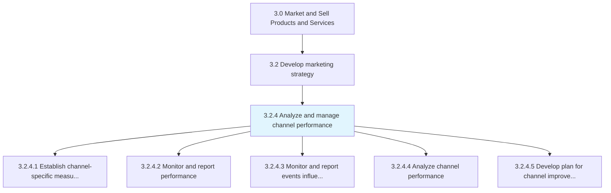
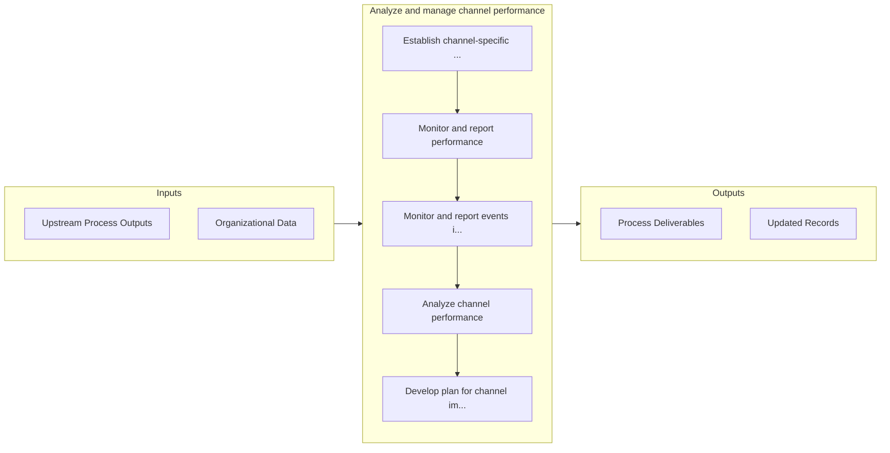

# Analyze and manage channel performance

> Monitoring marketing and distribution efforts of all channels individually and as a network.

## Overview

Process 3.2.4 is a core process that defines the specific procedures for analyze and manage channel performance. 

Monitoring marketing and distribution efforts of all channels individually and as a network. Re-distribute or add resources to channels that perform better than expected. Purge or consolidate under-performing channels, and find more promising replacements.

## Process Hierarchy



## Key Statistics

| Metric | Value |
|--------|-------|
| APQC Code | 20006 |
| Hierarchy ID | 3.2.4 |
| Level | Process |
| Parent | [3.2](../) |
| Sub-Processes | 5 |


## GraphDL Semantic Structure

```graphdl
analyze.AndManageChannelPerformance
```

| Component | Value | Description |
|-----------|-------|-------------|
| Verb | `analyze` | Primary action |
| Object | `and manage channel performance` | Direct object |


## Process Flow



## Sub-Processes

| Process | Hierarchy ID | Description |
|---------|-------------|-------------|
| [Establish channel-specific measures and targets](./EstablishChannelspecificMeasuresAndTargets) | 3.2.4.1 | Determining measurable parameters to be used for comparing the performance of different marketing ch |
| [Monitor and report performance](./MonitorAndReportPerformance) | 3.2.4.2 | Tracking trends and changes in performance inside individual marketing channels and in channels coll |
| [Monitor and report events influencing factors](./MonitorAndReportEventsInfluencingFactors) | 3.2.4.3 | Analyzing the factors and circumstances that influence desired outcomes |
| [Analyze channel performance](./AnalyzeChannelPerformance) | 3.2.4.4 | Conducting an analysis to review channel performance with respect to chosen metrics, benchmarks and  |
| [Develop plan for channel improvements](./DevelopPlanForChannelImprovements) | 3.2.4.5 | Devising a course of action to be taken to improve under-performing channels and to promote or expan |


## Related Concepts

- ChannelPerformance
- ChannelPerformance


---

*Source: APQC PCF 20006 (3.2.4) - APQC*
