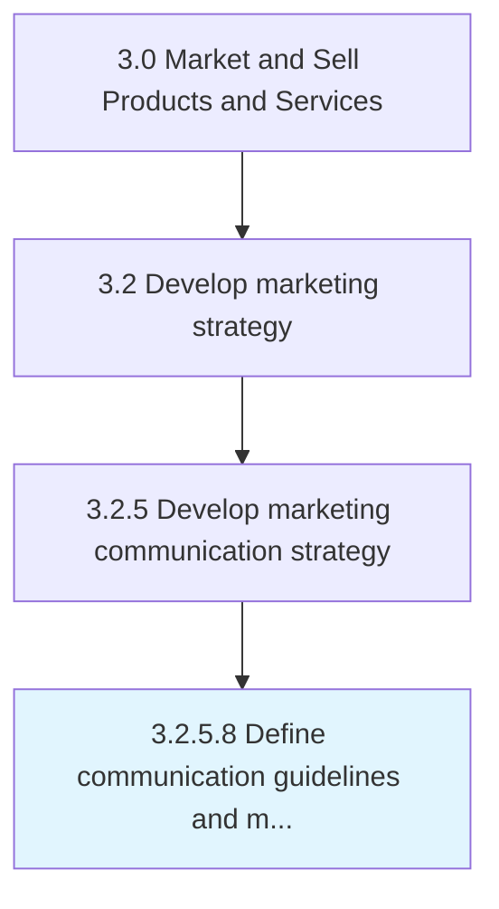

# Define communication guidelines and mechanisms

> Establishing standardized procedures for effective communication that maximizes ROI, promotes brand awareness and respects customers.

## Overview

Activity 3.2.5.8 is an activity within the Market and Sell Products and Services framework. 

Establishing standardized procedures for effective communication that maximizes ROI, promotes brand awareness and respects customers. In its simplest form, it includes a message (what is to be said), a target (to whom the message is reaching) and a medium or a channel (where the message is to be said).

## Process Hierarchy



## Key Statistics

| Metric | Value |
|--------|-------|
| APQC Code | 18627 |
| Hierarchy ID | 3.2.5.8 |
| Level | Activity |
| Parent | [3.2.5](../) |
| Sub-Processes | 0 |


## GraphDL Semantic Structure

```
define.CommunicationGuidelinesAndMechanisms
```

| Component | Value | Description |
|-----------|-------|-------------|
| Verb | `define` | Primary action |
| Object | `communication guidelines and mechanisms` | Direct object |


## Related Concepts

- CommunicationGuidelines
- Mechanisms


---

*Source: APQC PCF 18627 (3.2.5.8) - APQC*
