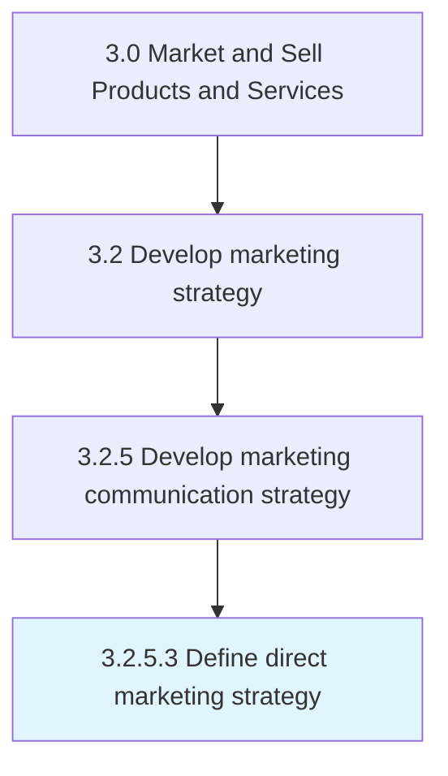

# Define direct marketing strategy

> Devising a master plan how to select potential customers or qualified clients for customized offers, and contact them on one-to-one basis through chat, phone, email or regular mail.

## Overview

Activity 3.2.5.3 is an activity within the Market and Sell Products and Services framework. 

Devising a master plan how to select potential customers or qualified clients for customized offers, and contact them on one-to-one basis through chat, phone, email or regular mail. The strategy would need to take into account that personalizing offers and contacting customers individually is an effective but resource-intensive marketing technique, and that ill-targeted offers risk at angering and alienating the contactees.

## Process Hierarchy



## Key Statistics

| Metric | Value |
|--------|-------|
| APQC Code | 16851 |
| Hierarchy ID | 3.2.5.3 |
| Level | Activity |
| Parent | [3.2.5](../) |
| Sub-Processes | 0 |


## GraphDL Semantic Structure

```
define.DirectMarketingStrategy
```

| Component | Value | Description |
|-----------|-------|-------------|
| Verb | `define` | Primary action |
| Object | `direct marketing strategy` | Direct object |


## Related Concepts

- DirectMarketingStrategy


---

*Source: APQC PCF 16851 (3.2.5.3) - APQC*
