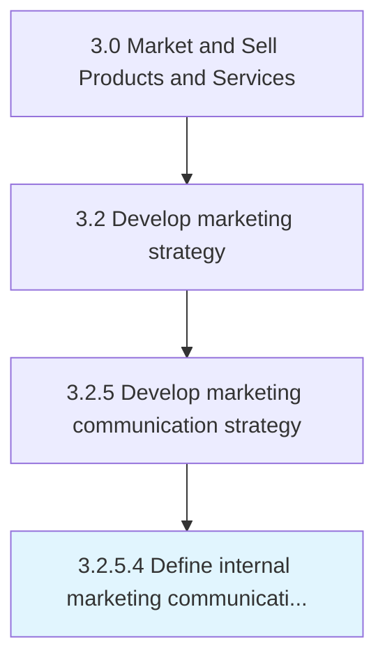

# Define internal marketing communication strategy

> Developing a program to promote the objectives, values, products and services of the company to its employees by treating them as potential customers, in order to extend company client base, increase employee engagement or to foster brand advocacy.

## Overview

Activity 3.2.5.4 is an activity within the Market and Sell Products and Services framework. 

Developing a program to promote the objectives, values, products and services of the company to its employees by treating them as potential customers, in order to extend company client base, increase employee engagement or to foster brand advocacy.

## Process Hierarchy



## Key Statistics

| Metric | Value |
|--------|-------|
| APQC Code | 16852 |
| Hierarchy ID | 3.2.5.4 |
| Level | Activity |
| Parent | [3.2.5](../) |
| Sub-Processes | 0 |


## GraphDL Semantic Structure

```
define.InternalMarketingCommunicationStrategy
```

| Component | Value | Description |
|-----------|-------|-------------|
| Verb | `define` | Primary action |
| Object | `internal marketing communication strategy` | Direct object |


## Related Concepts

- [InternalMarketingCommunicationStrategy](/concepts/InternalMarketingCommunicationStrategy)


---

*Source: APQC PCF 16852 (3.2.5.4) - APQC*
