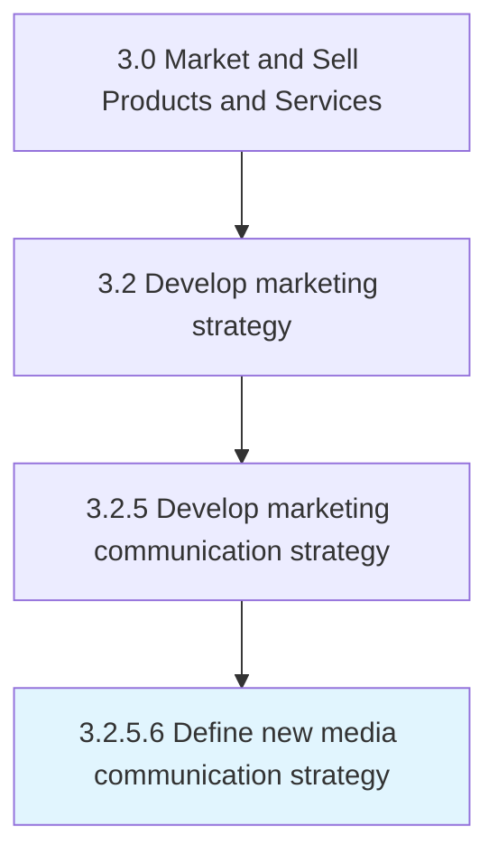

# Define new media communication strategy

> Developing a marketing strategy that is maximally effective in a new or emerging media channel by capitalizing on its novel attributes and capabilities.

## Overview

Activity 3.2.5.6 is an activity within the Market and Sell Products and Services framework. 

Developing a marketing strategy that is maximally effective in a new or emerging media channel by capitalizing on its novel attributes and capabilities.

## Process Hierarchy



## Key Statistics

| Metric | Value |
|--------|-------|
| APQC Code | 16854 |
| Hierarchy ID | 3.2.5.6 |
| Level | Activity |
| Parent | [3.2.5](../) |
| Sub-Processes | 0 |


## GraphDL Semantic Structure

```
define.NewMediaCommunicationStrategy
```

| Component | Value | Description |
|-----------|-------|-------------|
| Verb | `define` | Primary action |
| Object | `new media communication strategy` | Direct object |


## Related Concepts

- [NewMediaCommunicationStrategy](/concepts/NewMediaCommunicationStrategy)


---

*Source: APQC PCF 16854 (3.2.5.6) - APQC*
