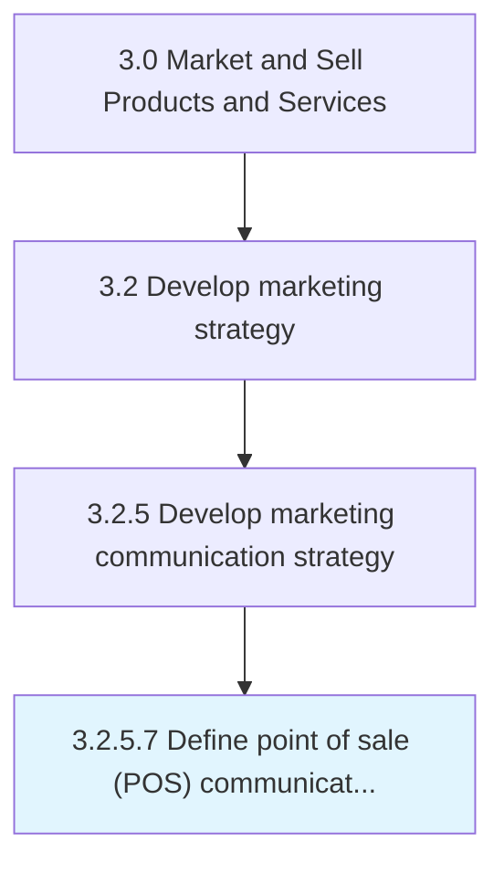

# Define point of sale (POS) communication strategy

> Establishing a framework for coordinated marketing to increase the profitability and increase brand awareness at the point of sale.

## Overview

Activity 3.2.5.7 is an activity within the Market and Sell Products and Services framework. 

Establishing a framework for coordinated marketing to increase the profitability and increase brand awareness at the point of sale. This may include promotional posters on product shelves or island displays, advertisements in shopping carts, stickers on the floor that lead consumers to the promoted product, multi-buy promotions, coupons on sales receipts, etc.

## Process Hierarchy



## Key Statistics

| Metric | Value |
|--------|-------|
| APQC Code | 16855 |
| Hierarchy ID | 3.2.5.7 |
| Level | Activity |
| Parent | [3.2.5](../) |
| Sub-Processes | 0 |


## GraphDL Semantic Structure

```
define.Point.of.SalePOSCommunicationStrategy
```

| Component | Value | Description |
|-----------|-------|-------------|
| Verb | `define` | Primary action |
| Object | `point` | Direct object |
| Preposition | `of` | Relationship |
| PrepObject | `sale (POS) communication strategy` | Indirect object |


---

*Source: APQC PCF 16855 (3.2.5.7) - APQC*
