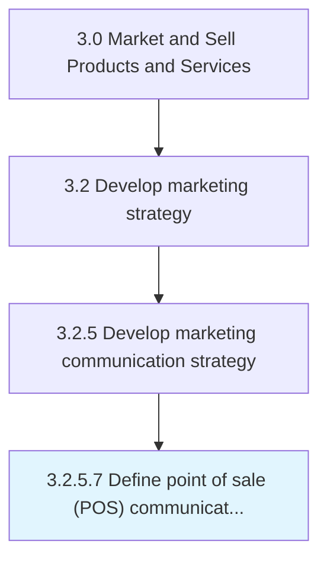

# Define point of sale (POS) communication strategy

> Establishing a framework for coordinated marketing to increase the profitability and increase brand awareness at the point of sale.

## Overview

Activity 3.2.5.7 is an activity within the Market and Sell Products and Services framework.

Establishing a framework for coordinated marketing to increase the profitability and increase brand awareness at the point of sale. This may include promotional posters on product shelves or island displays, advertisements in shopping carts, stickers on the floor that lead consumers to the promoted product, multi-buy promotions, coupons on sales receipts, etc.

This process is critical to effective sales and marketing execution. It ensures that activities are systematically planned, executed, and measured against organizational objectives. When performed effectively, this process drives revenue growth, enhances customer engagement, and strengthens competitive positioning in target markets.

## Process Hierarchy



## Key Statistics

| Metric | Value |
|--------|-------|
| APQC Code | 16855 |
| Hierarchy ID | 3.2.5.7 |
| Level | Activity |
| Parent | [3.2.5](../) |
| Sub-Processes | 0 |

## Process Flow


## GraphDL Semantic Structure

```
define.Point.of.SalePOSCommunicationStrategy
```

| Component | Value | Description |
|-----------|-------|-------------|
| Verb | `define` | Primary action |
| Object | `point` | Direct object |
| Preposition | `of` | Relationship |
| PrepObject | `sale (POS) communication strategy` | Indirect object |


## RACI Matrix

| Role | Responsible | Accountable | Consulted | Informed |
|------|:-----------:|:-----------:|:---------:|:--------:|
| Marketing Manager | R |  |  |  |
| CMO / VP Marketing |  | A |  |  |
| Sales Manager |  |  | C |  |
| Product Manager |  |  | C |  |
| Finance Manager |  |  |  | I |

## Related Occupations

- [Marketing Managers](/occupations/Management/MarketingManagers)
- [Advertising And Promotions Managers](/occupations/Management/AdvertisingAndPromotionsManagers)
- [Market Research Analysts](/occupations/Business-and-Financial-Operations/MarketResearchAnalysts)
- [Public Relations Specialists](/occupations/Media-and-Communication/PublicRelationsSpecialists)
- [Sales Managers](/occupations/Management/SalesManagers)

## Related Departments

- [Marketing](/departments/Marketing)
- [Product Management](/departments/ProductManagement)
- [Sales](/departments/Sales)

## Industry Variations

### Consumer Products

In consumer products, define point of sale (pos) communication strategy centers on brand positioning across multiple product lines, seasonal marketing calendars, and trade marketing strategies.

### Technology

In technology, define point of sale (pos) communication strategy emphasizes digital-first strategies, developer community engagement, and product-led growth approaches.

### Life Sciences

In life sciences, define point of sale (pos) communication strategy must comply with FDA advertising regulations, focus on HCP engagement, and navigate complex approval processes for promotional materials.

## KPIs & Metrics

| Metric | Description | Target |
|--------|-------------|--------|
| Brand Awareness | Percentage of target market aware of brand and value proposition | >60% |
| Channel ROI | Return on investment across marketing channels | >3:1 |
| Customer Acquisition Cost (CAC) | Average cost to acquire a new customer | Below industry benchmark |
| Marketing Qualified Leads (MQLs) | Number of qualified leads generated by marketing | Quarter-over-quarter growth |

## Related Concepts


---

*Source: APQC PCF 16855 (3.2.5.7) - APQC*
