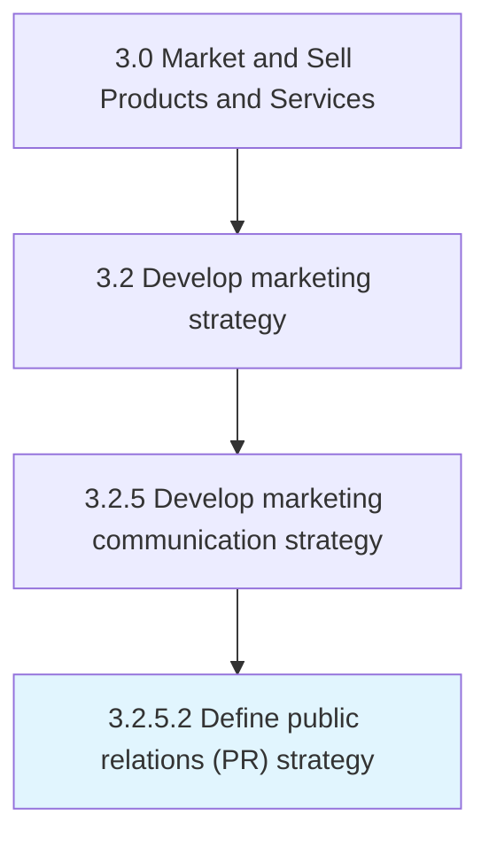

# Define public relations (PR) strategy

> Deciding how to promote and maintain a favorable public image of the company in the eyes of its employees, customers, investors, suppliers, politicians or the general public.

## Overview

Activity 3.2.5.2 is an activity within the Market and Sell Products and Services framework. 

Deciding how to promote and maintain a favorable public image of the company in the eyes of its employees, customers, investors, suppliers, politicians or the general public. This may involve various means but is frequently conducted through publicity, education, corporate social responsibility, charitable causes or civic engagements.

## Process Hierarchy



## Key Statistics

| Metric | Value |
|--------|-------|
| APQC Code | 16850 |
| Hierarchy ID | 3.2.5.2 |
| Level | Activity |
| Parent | [3.2.5](../) |
| Sub-Processes | 0 |


## GraphDL Semantic Structure

```
define.PublicRelationsPRStrategy
```

| Component | Value | Description |
|-----------|-------|-------------|
| Verb | `define` | Primary action |
| Object | `public relations (PR) strategy` | Direct object |


---

*Source: APQC PCF 16850 (3.2.5.2) - APQC*
