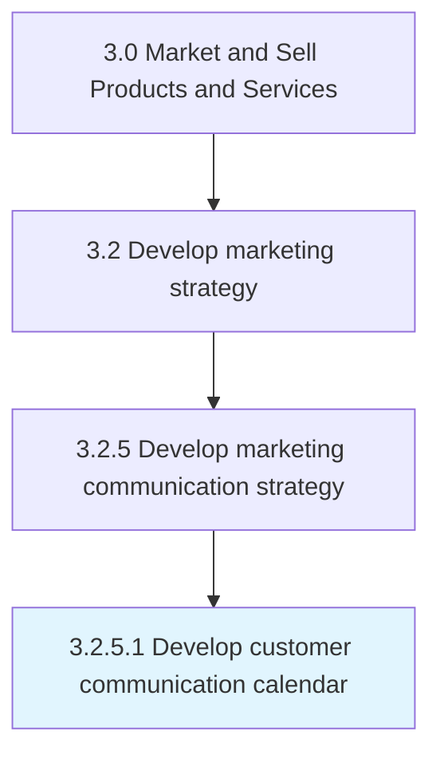

# Develop customer communication calendar

> Timing and scheduling the delivery of marketing messages to maximize their impact on customer purchasing behavior.

## Overview

Activity 3.2.5.1 is an activity within the Market and Sell Products and Services framework. 

Timing and scheduling the delivery of marketing messages to maximize their impact on customer purchasing behavior. Integrate individual messages to larger marketing campaigns and to seasonal purchasing patterns.

## Process Hierarchy



## Key Statistics

| Metric | Value |
|--------|-------|
| APQC Code | 16849 |
| Hierarchy ID | 3.2.5.1 |
| Level | Activity |
| Parent | [3.2.5](../) |
| Sub-Processes | 0 |


## GraphDL Semantic Structure

```
develop.CustomerCommunicationCalendar
```

| Component | Value | Description |
|-----------|-------|-------------|
| Verb | `develop` | Primary action |
| Object | `customer communication calendar` | Direct object |


## Related Concepts

- [CustomerCommunicationCalendar](/concepts/CustomerCommunicationCalendar)


---

*Source: APQC PCF 16849 (3.2.5.1) - APQC*
