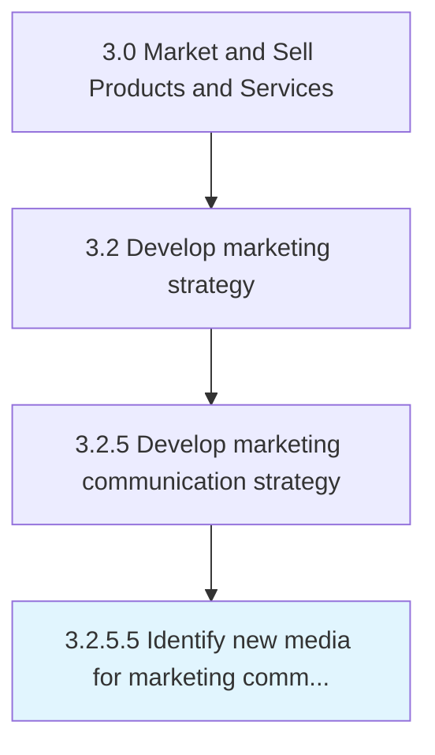

# Identify new media for marketing communication

> Finding emerging media based on digital or other technologies that would enable the company to increase the speed and volume of marketing communications, to make communications more interactive and to customize promotional messages more easily to the target audience, thus rendering them more effective.

## Overview

Activity 3.2.5.5 is an activity within the Market and Sell Products and Services framework.

Finding emerging media based on digital or other technologies that would enable the company to increase the speed and volume of marketing communications, to make communications more interactive and to customize promotional messages more easily to the target audience, thus rendering them more effective.

This process is critical to effective sales and marketing execution. It ensures that activities are systematically planned, executed, and measured against organizational objectives. When performed effectively, this process drives revenue growth, enhances customer engagement, and strengthens competitive positioning in target markets.

## Process Hierarchy



## Key Statistics

| Metric | Value |
|--------|-------|
| APQC Code | 16853 |
| Hierarchy ID | 3.2.5.5 |
| Level | Activity |
| Parent | [3.2.5](../) |
| Sub-Processes | 0 |

## Process Flow


## GraphDL Semantic Structure

```graphdl
identify.NewMedia.for.MarketingCommunication
```

| Component | Value | Description |
|-----------|-------|-------------|
| Verb | `identify` | Primary action |
| Object | `new media` | Direct object |
| Preposition | `for` | Relationship |
| PrepObject | `marketing communication` | Indirect object |


## RACI Matrix

| Role | Responsible | Accountable | Consulted | Informed |
|------|:-----------:|:-----------:|:---------:|:--------:|
| Marketing Manager | R |  |  |  |
| CMO / VP Marketing |  | A |  |  |
| Sales Manager |  |  | C |  |
| Product Manager |  |  | C |  |
| Finance Manager |  |  |  | I |

## Related Occupations

- [Marketing Managers](/occupations/Management/MarketingManagers)
- [Advertising And Promotions Managers](/occupations/Management/AdvertisingAndPromotionsManagers)
- [Market Research Analysts](/occupations/Business-and-Financial-Operations/MarketResearchAnalysts)
- [Public Relations Specialists](/occupations/Media-and-Communication/PublicRelationsSpecialists)
- [Sales Managers](/occupations/Management/SalesManagers)

## Related Departments

- [Marketing](/departments/Marketing)
- Product Management
- [Sales](/departments/Sales)

## Industry Variations

### Consumer Products

In consumer products, identify new media for marketing communication centers on brand positioning across multiple product lines, seasonal marketing calendars, and trade marketing strategies.

### Technology

In technology, identify new media for marketing communication emphasizes digital-first strategies, developer community engagement, and product-led growth approaches.

### Life Sciences

In life sciences, identify new media for marketing communication must comply with FDA advertising regulations, focus on HCP engagement, and navigate complex approval processes for promotional materials.

## KPIs & Metrics

| Metric | Description | Target |
|--------|-------------|--------|
| Brand Awareness | Percentage of target market aware of brand and value proposition | >60% |
| Channel ROI | Return on investment across marketing channels | >3:1 |
| Customer Acquisition Cost (CAC) | Average cost to acquire a new customer | Below industry benchmark |
| Marketing Qualified Leads (MQLs) | Number of qualified leads generated by marketing | Quarter-over-quarter growth |

## Related Concepts

- NewMedia
- MarketingCommunication

---

*Source: APQC PCF 16853 (3.2.5.5) - APQC*
