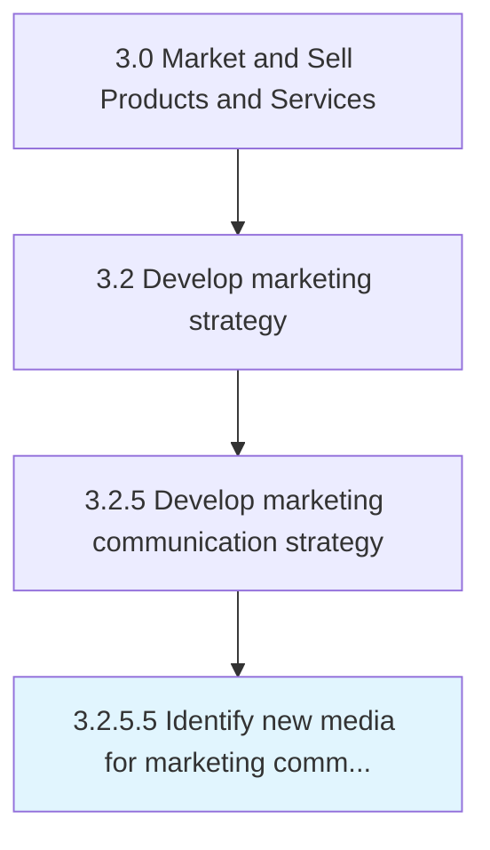

# Identify new media for marketing communication

> Finding emerging media based on digital or other technologies that would enable the company to increase the speed and volume of marketing communications, to make communications more interactive and to customize promotional messages more easily to the target audience, thus rendering them more effective.

## Overview

Activity 3.2.5.5 is an activity within the Market and Sell Products and Services framework. 

Finding emerging media based on digital or other technologies that would enable the company to increase the speed and volume of marketing communications, to make communications more interactive and to customize promotional messages more easily to the target audience, thus rendering them more effective.

## Process Hierarchy



## Key Statistics

| Metric | Value |
|--------|-------|
| APQC Code | 16853 |
| Hierarchy ID | 3.2.5.5 |
| Level | Activity |
| Parent | [3.2.5](../) |
| Sub-Processes | 0 |


## GraphDL Semantic Structure

```
identify.NewMedia.for.MarketingCommunication
```

| Component | Value | Description |
|-----------|-------|-------------|
| Verb | `identify` | Primary action |
| Object | `new media` | Direct object |
| Preposition | `for` | Relationship |
| PrepObject | `marketing communication` | Indirect object |


## Related Concepts

- NewMedia
- MarketingCommunication


---

*Source: APQC PCF 16853 (3.2.5.5) - APQC*
