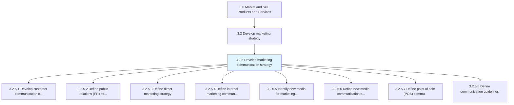
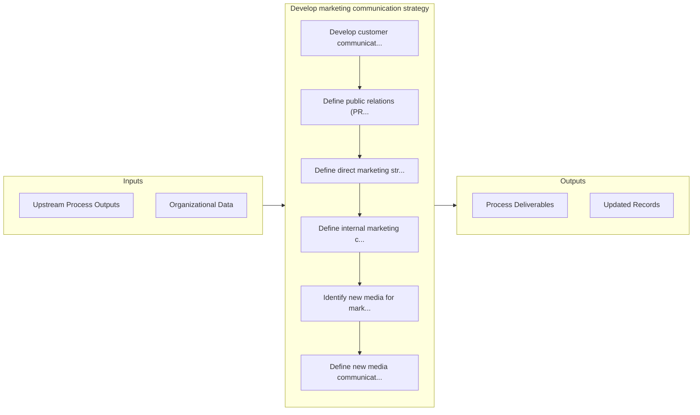

# Develop marketing communication strategy

> Establishing marketing communications that deliver promotional messages, in a coordinated way, through multiple marketing channels, such as print, radio, television, direct mail, online or mobile advertising, email, social media or personal selling.

## Overview

Process 3.2.5 is a core process that defines the specific procedures for develop marketing communication strategy. 

Establishing marketing communications that deliver promotional messages, in a coordinated way, through multiple marketing channels, such as print, radio, television, direct mail, online or mobile advertising, email, social media or personal selling.

## Process Hierarchy



## Key Statistics

| Metric | Value |
|--------|-------|
| APQC Code | 16848 |
| Hierarchy ID | 3.2.5 |
| Level | Process |
| Parent | [3.2](../) |
| Sub-Processes | 8 |


## GraphDL Semantic Structure

```graphdl
develop.MarketingCommunicationStrategy
```

| Component | Value | Description |
|-----------|-------|-------------|
| Verb | `develop` | Primary action |
| Object | `marketing communication strategy` | Direct object |


## Process Flow



## Sub-Processes

| Process | Hierarchy ID | Description |
|---------|-------------|-------------|
| [Develop customer communication calendar](./DevelopCustomerCommunicationCalendar) | 3.2.5.1 | Timing and scheduling the delivery of marketing messages to maximize their impact on customer purcha |
| [Define public relations (PR) strategy](./DefinePublicRelationsPRStrategy) | 3.2.5.2 | Deciding how to promote and maintain a favorable public image of the company in the eyes of its empl |
| [Define direct marketing strategy](./DefineDirectMarketingStrategy) | 3.2.5.3 | Devising a master plan how to select potential customers or qualified clients for customized offers, |
| [Define internal marketing communication strategy](./DefineInternalMarketingCommunicationStrategy) | 3.2.5.4 | Developing a program to promote the objectives, values, products and services of the company to its  |
| [Identify new media for marketing communication](./IdentifyNewMediaForMarketingCommunication) | 3.2.5.5 | Finding emerging media based on digital or other technologies that would enable the company to incre |
| [Define new media communication strategy](./DefineNewMediaCommunicationStrategy) | 3.2.5.6 | Developing a marketing strategy that is maximally effective in a new or emerging media channel by ca |
| [Define point of sale (POS) communication strategy](./DefinePointOfSalePOSCommunicationStrategy) | 3.2.5.7 | Establishing a framework for coordinated marketing to increase the profitability and increase brand  |
| [Define communication guidelines and mechanisms](./DefineCommunicationGuidelinesAndMechanisms) | 3.2.5.8 | Establishing standardized procedures for effective communication that maximizes ROI, promotes brand  |


## Related Concepts

- MarketingCommunicationStrategy


---

*Source: APQC PCF 16848 (3.2.5) - APQC*
