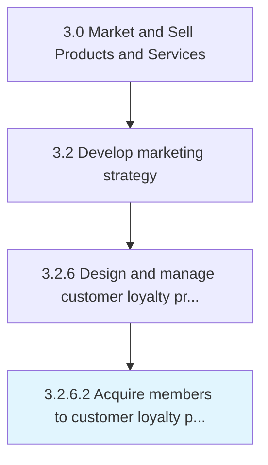
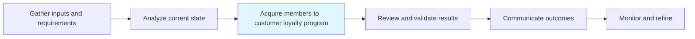

# Acquire members to customer loyalty program

> Convincing customers to register their personal information with the company and be assigned a unique identifier that they use when making purchases.

## Overview

Activity 3.2.6.2 is an activity within the Market and Sell Products and Services framework.

Convincing customers to register their personal information with the company and be assigned a unique identifier that they use when making purchases. The identifier makes it easier for the company to track customer purchases. Customers are rewarded by various incentives that encourage repeat business [20007].

This process is critical to effective sales and marketing execution. It ensures that activities are systematically planned, executed, and measured against organizational objectives. When performed effectively, this process drives revenue growth, enhances customer engagement, and strengthens competitive positioning in target markets.

## Process Hierarchy



## Key Statistics

| Metric | Value |
|--------|-------|
| APQC Code | 18925 |
| Hierarchy ID | 3.2.6.2 |
| Level | Activity |
| Parent | [3.2.6](../) |
| Sub-Processes | 0 |

## Process Flow



## GraphDL Semantic Structure

```graphdl
acquire.Members.to.CustomerLoyaltyProgram
```

| Component | Value | Description |
|-----------|-------|-------------|
| Verb | `acquire` | Primary action |
| Object | `members` | Direct object |
| Preposition | `to` | Relationship |
| PrepObject | `customer loyalty program` | Indirect object |


## RACI Matrix

| Role | Responsible | Accountable | Consulted | Informed |
|------|:-----------:|:-----------:|:---------:|:--------:|
| Marketing Manager | R |  |  |  |
| CMO / VP Marketing |  | A |  |  |
| Sales Manager |  |  | C |  |
| Product Manager |  |  | C |  |
| Finance Manager |  |  |  | I |

## Related Occupations

- [Marketing Managers](/occupations/Management/MarketingManagers)
- [Advertising And Promotions Managers](/occupations/Management/AdvertisingAndPromotionsManagers)
- [Market Research Analysts](/occupations/Business-and-Financial-Operations/MarketResearchAnalysts)
- [Public Relations Specialists](/occupations/Media-and-Communication/PublicRelationsSpecialists)
- [Sales Managers](/occupations/Management/SalesManagers)

## Related Departments

- [Marketing](/departments/Marketing)
- Product Management
- [Sales](/departments/Sales)

## Industry Variations

### Consumer Products

In consumer products, acquire members to customer loyalty program centers on brand positioning across multiple product lines, seasonal marketing calendars, and trade marketing strategies.

### Technology

In technology, acquire members to customer loyalty program emphasizes digital-first strategies, developer community engagement, and product-led growth approaches.

### Life Sciences

In life sciences, acquire members to customer loyalty program must comply with FDA advertising regulations, focus on HCP engagement, and navigate complex approval processes for promotional materials.

## KPIs & Metrics

| Metric | Description | Target |
|--------|-------------|--------|
| Brand Awareness | Percentage of target market aware of brand and value proposition | >60% |
| Channel ROI | Return on investment across marketing channels | >3:1 |
| Customer Acquisition Cost (CAC) | Average cost to acquire a new customer | Below industry benchmark |
| Marketing Qualified Leads (MQLs) | Number of qualified leads generated by marketing | Quarter-over-quarter growth |

## Related Concepts

- Members
- CustomerLoyaltyProgram

---

*Source: APQC PCF 18925 (3.2.6.2) - APQC*
