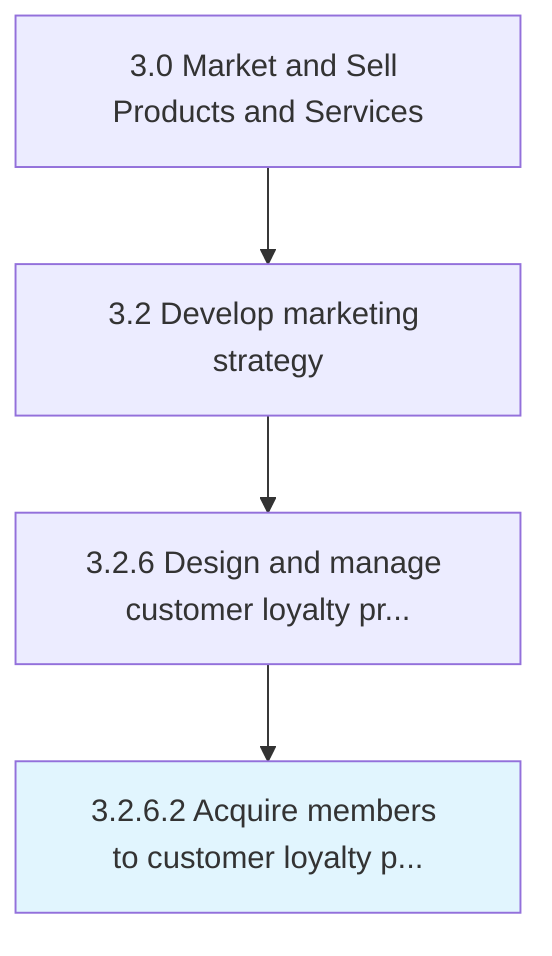

# Acquire members to customer loyalty program

> Convincing customers to register their personal information with the company and be assigned a unique identifier that they use when making purchases.

## Overview

Activity 3.2.6.2 is an activity within the Market and Sell Products and Services framework. 

Convincing customers to register their personal information with the company and be assigned a unique identifier that they use when making purchases. The identifier makes it easier for the company to track customer purchases. Customers are rewarded by various incentives that encourage repeat business [20007].

## Process Hierarchy



## Key Statistics

| Metric | Value |
|--------|-------|
| APQC Code | 18925 |
| Hierarchy ID | 3.2.6.2 |
| Level | Activity |
| Parent | [3.2.6](../) |
| Sub-Processes | 0 |


## GraphDL Semantic Structure

```
acquire.Members.to.CustomerLoyaltyProgram
```

| Component | Value | Description |
|-----------|-------|-------------|
| Verb | `acquire` | Primary action |
| Object | `members` | Direct object |
| Preposition | `to` | Relationship |
| PrepObject | `customer loyalty program` | Indirect object |


## Related Concepts

- [Members](/concepts/Members)
- [CustomerLoyaltyProgram](/concepts/CustomerLoyaltyProgram)


---

*Source: APQC PCF 18925 (3.2.6.2) - APQC*
