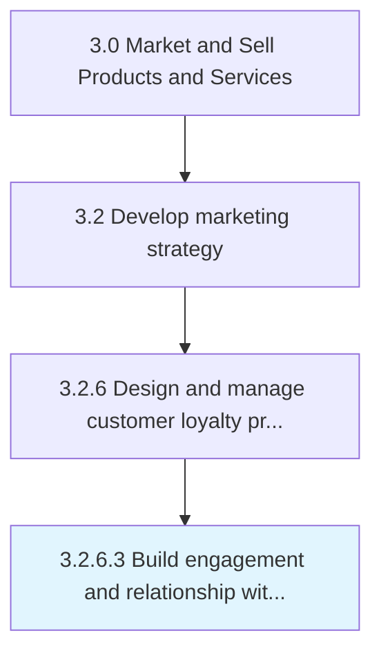

# Build engagement and relationship with members

> Building deeper relationships between a customer and a brand in order to promote customer loyalty and derive repeat business.

## Overview

Activity 3.2.6.3 is an activity within the Market and Sell Products and Services framework. 

Building deeper relationships between a customer and a brand in order to promote customer loyalty and derive repeat business. Besides making frequent purchases, highly engaged customers refer family, friends and colleagues to make purchases as well, consume and re-broadcast promotional materials, provide feedback to the purchases they make and do not support competing brands.

## Process Hierarchy



## Key Statistics

| Metric | Value |
|--------|-------|
| APQC Code | 18926 |
| Hierarchy ID | 3.2.6.3 |
| Level | Activity |
| Parent | [3.2.6](../) |
| Sub-Processes | 0 |


## GraphDL Semantic Structure

```
build.EngagementAndRelationship.with.Members
```

| Component | Value | Description |
|-----------|-------|-------------|
| Verb | `build` | Primary action |
| Object | `engagement and relationship` | Direct object |
| Preposition | `with` | Relationship |
| PrepObject | `members` | Indirect object |


## Related Concepts

- Engagement
- Members
- Relationship
- Members


---

*Source: APQC PCF 18926 (3.2.6.3) - APQC*
