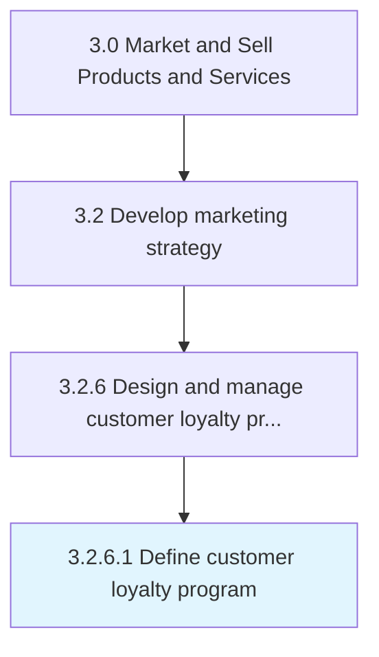

# Define customer loyalty program

> Devising procedures and mechanisms to retain existing customers, promote repeat business and increase the likelihood that previous customers to continue to buy products or services from the company.

## Overview

Activity 3.2.6.1 is an activity within the Market and Sell Products and Services framework. 

Devising procedures and mechanisms to retain existing customers, promote repeat business and increase the likelihood that previous customers to continue to buy products or services from the company. This may be achieved by rewarding customers for repeat business by means of gifts, discounts, redeemable "points", or prioritized access to new products, events or services.

## Process Hierarchy



## Key Statistics

| Metric | Value |
|--------|-------|
| APQC Code | 20007 |
| Hierarchy ID | 3.2.6.1 |
| Level | Activity |
| Parent | [3.2.6](../) |
| Sub-Processes | 0 |


## GraphDL Semantic Structure

```
define.CustomerLoyaltyProgram
```

| Component | Value | Description |
|-----------|-------|-------------|
| Verb | `define` | Primary action |
| Object | `customer loyalty program` | Direct object |


## Related Concepts

- CustomerLoyaltyProgram


---

*Source: APQC PCF 20007 (3.2.6.1) - APQC*
