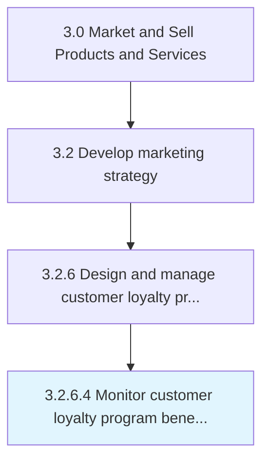

# Monitor customer loyalty program benefits to the enterprise and the customer

> Surveying and tracking the benefits of customer loyalty programs both for the company and for customers.

## Overview

Activity 3.2.6.4 is an activity within the Market and Sell Products and Services framework. 

Surveying and tracking the benefits of customer loyalty programs both for the company and for customers. Compare with comparable loyalty programs instituted in competitor companies. Propose changes as needed to keep up with market trends.

## Process Hierarchy



## Key Statistics

| Metric | Value |
|--------|-------|
| APQC Code | 16633 |
| Hierarchy ID | 3.2.6.4 |
| Level | Activity |
| Parent | [3.2.6](../) |
| Sub-Processes | 0 |


## GraphDL Semantic Structure

```
monitor.CustomerLoyaltyProgramBenefits.to.TheEnterpriseAndTheCustomer
```

| Component | Value | Description |
|-----------|-------|-------------|
| Verb | `monitor` | Primary action |
| Object | `customer loyalty program benefits` | Direct object |
| Preposition | `to` | Relationship |
| PrepObject | `the enterprise and the customer` | Indirect object |


## Related Concepts

- [CustomerLoyaltyProgramBenefits](/concepts/CustomerLoyaltyProgramBenefits)
- [Enterprise](/concepts/Enterprise)
- [CustomerLoyaltyProgramBenefits](/concepts/CustomerLoyaltyProgramBenefits)
- [Customer](/concepts/Customer)


---

*Source: APQC PCF 16633 (3.2.6.4) - APQC*
