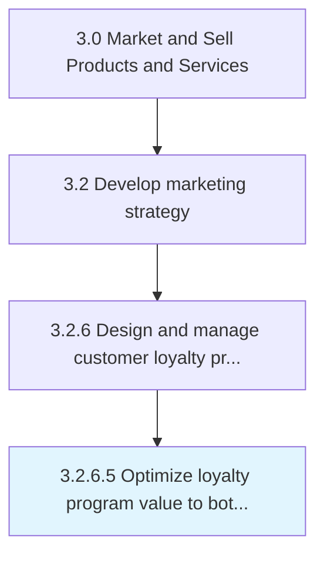

# Optimize loyalty program value to both the enterprise and the customer

> Enhancing the customer loyalty program so that it will yield maximum value both for the company and for the patrons enrolled in the program, increasing customer retention and continued engagement.

## Overview

Activity 3.2.6.5 is an activity within the Market and Sell Products and Services framework. 

Enhancing the customer loyalty program so that it will yield maximum value both for the company and for the patrons enrolled in the program, increasing customer retention and continued engagement.

## Process Hierarchy



## Key Statistics

| Metric | Value |
|--------|-------|
| APQC Code | 18927 |
| Hierarchy ID | 3.2.6.5 |
| Level | Activity |
| Parent | [3.2.6](../) |
| Sub-Processes | 0 |


## GraphDL Semantic Structure

```
optimize.LoyaltyProgramValue.to.BothTheEnterpriseAndTheCustomer
```

| Component | Value | Description |
|-----------|-------|-------------|
| Verb | `optimize` | Primary action |
| Object | `loyalty program value` | Direct object |
| Preposition | `to` | Relationship |
| PrepObject | `both the enterprise and the customer` | Indirect object |


## Related Concepts

- LoyaltyProgramValue
- Enterprise
- LoyaltyProgramValue
- Customer


---

*Source: APQC PCF 18927 (3.2.6.5) - APQC*
