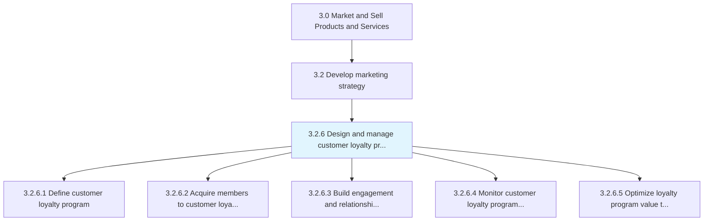
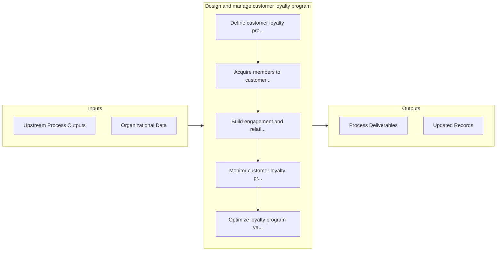

# Design and manage customer loyalty program

> Creating and managing a customer loyalty program.

## Overview

Process 3.2.6 is a core process that defines the specific procedures for design and manage customer loyalty program. 

Creating and managing a customer loyalty program. The loyalty program is a key part of marketing, with an elaborate strategy and process for acquiring, retaining, and engaging with members. Members are engaged and acquainted to the loyalty program, thus growing relationship and adding value through the program.

## Process Hierarchy



## Key Statistics

| Metric | Value |
|--------|-------|
| APQC Code | 18924 |
| Hierarchy ID | 3.2.6 |
| Level | Process |
| Parent | [3.2](../) |
| Sub-Processes | 5 |


## GraphDL Semantic Structure

```graphdl
design.AndManageCustomerLoyaltyProgram
```

| Component | Value | Description |
|-----------|-------|-------------|
| Verb | `design` | Primary action |
| Object | `and manage customer loyalty program` | Direct object |


## Process Flow



## Sub-Processes

| Process | Hierarchy ID | Description |
|---------|-------------|-------------|
| [Define customer loyalty program](./DefineCustomerLoyaltyProgram) | 3.2.6.1 | Devising procedures and mechanisms to retain existing customers, promote repeat business and increas |
| [Acquire members to customer loyalty program](./AcquireMembersToCustomerLoyaltyProgram) | 3.2.6.2 | Convincing customers to register their personal information with the company and be assigned a uniqu |
| [Build engagement and relationship with members](./BuildEngagementAndRelationshipWithMembers) | 3.2.6.3 | Building deeper relationships between a customer and a brand in order to promote customer loyalty an |
| [Monitor customer loyalty program benefits to the enterprise and the customer](./MonitorCustomerLoyaltyProgramBenefitsToTheEnterpriseAndTheCustomer) | 3.2.6.4 | Surveying and tracking the benefits of customer loyalty programs both for the company and for custom |
| [Optimize loyalty program value to both the enterprise and the customer](./OptimizeLoyaltyProgramValueToBothTheEnterpriseAndTheCustomer) | 3.2.6.5 | Enhancing the customer loyalty program so that it will yield maximum value both for the company and  |


## Related Concepts

- CustomerLoyaltyProgram
- CustomerLoyaltyProgram


---

*Source: APQC PCF 18924 (3.2.6) - APQC*
