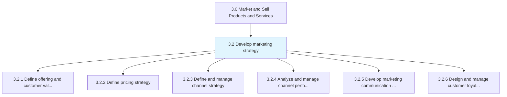
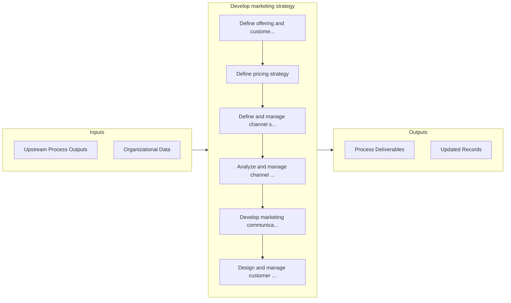

# Develop marketing strategy

> Charting a strategic course for marketing products/services.

## Overview

Group 3.2 is a process group within APQC Category 3.0 (Market and Sell Products and Services). 

Charting a strategic course for marketing products/services. This will include defining the value proposition, creating a mechanism for pricing, and determining the right mix of marketing channels. Create a specific positioning and branding for the organization's offerings. Enlist marketing head to lead, with inputs from the business development and sales functions.

## Process Hierarchy



## Key Statistics

| Metric | Value |
|--------|-------|
| APQC Code | 10102 |
| Hierarchy ID | 3.2 |
| Level | Group |
| Parent | [3](../) |
| Sub-Processes | 6 |


## GraphDL Semantic Structure

```
develop.MarketingStrategy
```

| Component | Value | Description |
|-----------|-------|-------------|
| Verb | `develop` | Primary action |
| Object | `marketing strategy` | Direct object |


## Process Flow



## Sub-Processes

| Process | Hierarchy ID | Description |
|---------|-------------|-------------|
| [Define offering and customer value proposition](./3.2.1-DefineOfferingCustomerValue/) | 3.2.1 | Refining the attributes of organizational offerings to define their value proposition for the custom |
| [Define pricing strategy](./3.2.2-DefinePricingStrategy/) | 3.2.2 | Creating a pricing strategy and mechanism that aligns with the benefits of the products/services, as |
| [Define and manage channel strategy](./3.2.3-DefineManageChannelStrategy/) | 3.2.3 | Establishing all the activities needed to identify the appropriate channels to market to different c |
| [Analyze and manage channel performance](./3.2.4-AnalyzeManageChannelPerformance/) | 3.2.4 | Monitoring marketing and distribution efforts of all channels individually and as a network |
| [Develop marketing communication strategy](./3.2.5-DevelopMarketingCommunicationStrategy/) | 3.2.5 | Establishing marketing communications that deliver promotional messages, in a coordinated way, throu |
| [Design and manage customer loyalty program](./3.2.6-DesignManageCustomerLoyalty/) | 3.2.6 | Creating and managing a customer loyalty program |


## Related Concepts

- MarketingStrategy


---

*Source: APQC PCF 10102 (3.2) - APQC*
